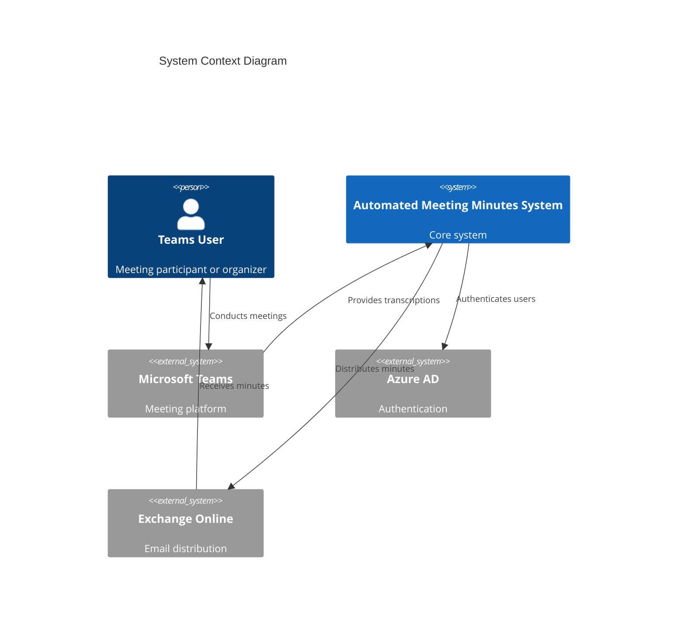
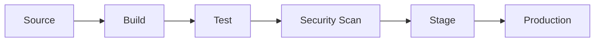

# Automated Meeting Minutes System

An enterprise-grade AI-powered solution that transforms Microsoft Teams meeting transcriptions into structured, actionable meeting minutes, delivering 90% reduction in documentation effort and 75% improvement in follow-up efficiency.

## Key Features

- Real-time Teams meeting transcription processing
- AI-powered topic extraction and summarization
- Automated action item detection and assignment
- Secure, compliant document distribution
- Enterprise-grade scalability and reliability

## System Architecture



## Prerequisites

- Azure Subscription with Owner/Contributor access
- Microsoft Teams Administrator privileges
- Azure AD B2C tenant
- Development tools:
  - Visual Studio 2022
  - .NET 6.0 SDK
  - Python 3.9
  - Docker Desktop
  - Azure CLI

## Installation

1. Clone the repository
```bash
git clone https://github.com/your-org/automated-meeting-minutes.git
cd automated-meeting-minutes
```

2. Configure Azure resources
```bash
cd infrastructure
terraform init
terraform plan -out=tfplan
terraform apply tfplan
```

3. Set up environment variables
```bash
cp .env.example .env
# Edit .env with your configuration
```

4. Deploy services
```bash
./deploy.sh --environment production
```

## Development Setup

1. Install dependencies
```bash
# Backend services
cd src/backend
dotnet restore

# AI processing
cd src/ai
python -m venv venv
source venv/bin/activate  # or .\venv\Scripts\activate on Windows
pip install -r requirements.txt
```

2. Run development environment
```bash
docker-compose up -d
```

3. Start services
```bash
# API Service
cd src/backend/Api
dotnet run

# Processing Service
cd src/backend/Processing
dotnet run
```

## Testing

```bash
# Run unit tests
dotnet test

# Run integration tests
./run-integration-tests.sh

# Run E2E tests
./run-e2e-tests.sh
```

## Deployment



### Production Deployment

1. Ensure all tests pass
2. Create release branch
3. Run security scans
4. Deploy to staging
5. Verify staging deployment
6. Deploy to production with blue-green strategy

## Contributing

1. Fork the repository
2. Create feature branch (`git checkout -b feature/amazing-feature`)
3. Commit changes (`git commit -m 'Add amazing feature'`)
4. Push to branch (`git push origin feature/amazing-feature`)
5. Open Pull Request

### Pull Request Requirements

- Passes all tests
- Maintains >80% code coverage
- Follows coding standards
- Includes documentation updates
- Security scan passed

## Security

- Azure AD B2C authentication
- Role-based access control
- Data encryption at rest and in transit
- Regular security audits
- Compliance with GDPR, SOC 2

## Monitoring

- Azure Application Insights integration
- Custom metrics and dashboards
- Automated alerting
- Performance monitoring
- Error tracking and logging

## Support

- Create GitHub issue for bugs/features
- Enterprise support: support@your-org.com
- SLA: 24/7 for critical issues
- Response time: 1 hour for P1 issues

## License

Copyright (c) 2023 Your Organization

All rights reserved. This software is proprietary and confidential.
Unauthorized copying or distribution is strictly prohibited.

## Version Compatibility

| Component | Version | Notes |
|-----------|---------|-------|
| .NET | 6.0 | LTS release |
| Python | 3.9 | ML processing |
| Node.js | 16.x | Development tools |
| Docker | 20.x | Container runtime |
| Kubernetes | 1.25+ | AKS deployment |
| Terraform | 1.5+ | Infrastructure |

## Additional Resources

- [API Documentation](src/backend/API.md)
- [Architecture Guide](docs/ARCHITECTURE.md)
- [Security Baseline](docs/SECURITY.md)
- [Operations Guide](docs/OPERATIONS.md)