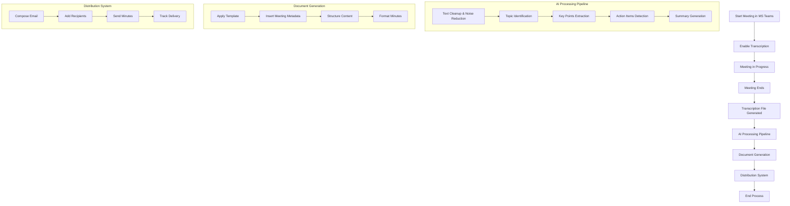
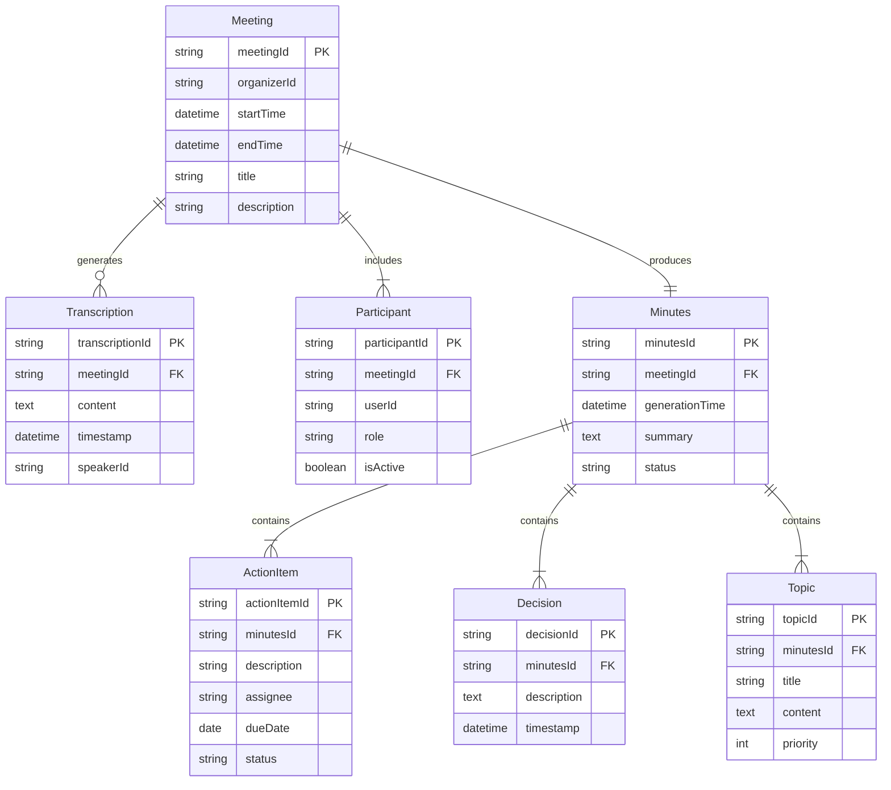
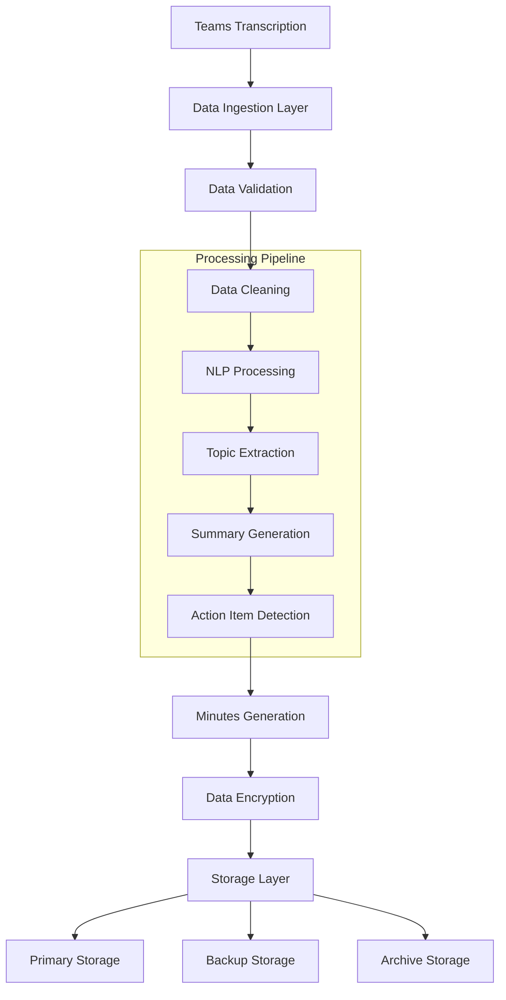
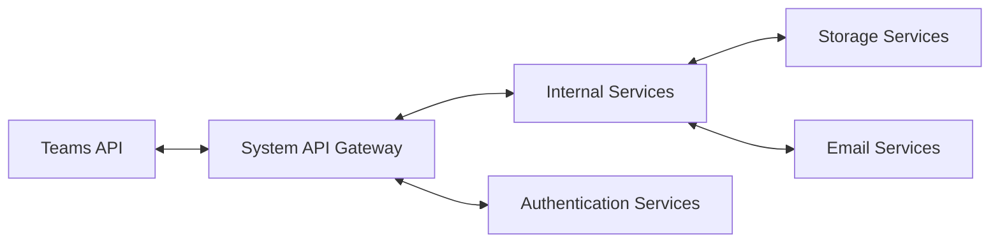

# Product Requirements Document (PRD)

# 1. INTRODUCTION

## 1.1 Purpose
This Software Requirements Specification (SRS) document provides a comprehensive description of the Automated Meeting Minutes System. It is intended for:
- Development team members responsible for implementation
- Project stakeholders and managers overseeing the development
- QA engineers who will validate the system
- Future maintainers of the software

## 1.2 Scope
The Automated Meeting Minutes System is an AI-powered solution that automatically generates structured meeting minutes from Microsoft Teams transcriptions. The system encompasses:

### Core Functionalities
- Automatic capture of Microsoft Teams meeting transcriptions
- AI-powered text processing and structuring
- Intelligent identification of key discussion points
- Automated distribution of meeting minutes

### Key Benefits
- Eliminates manual meeting documentation effort
- Ensures consistent and structured meeting documentation
- Reduces time between meeting conclusion and minutes distribution
- Improves meeting follow-up and action item tracking

### Product Features
1. Transcription Processing
   - Direct integration with Microsoft Teams transcription
   - Automated text cleanup and noise reduction
   - Removal of communication artifacts and filler words

2. AI-Enhanced Content Analysis
   - Topic identification and categorization
   - Key point extraction
   - Conversation flow comprehension
   - Smart summarization

3. Structured Output Generation
   - Meeting organizer and attendee information
   - Main discussion topics
   - Detailed meeting summary
   - Decision records
   - Action items and commitments
   - Active participant tracking

4. Automated Distribution
   - Immediate post-meeting processing
   - Automatic delivery to meeting organizer
   - Standardized format and structure

# 2. PRODUCT DESCRIPTION

## 2.1 Product Perspective
The Automated Meeting Minutes System operates as a complementary service within the Microsoft Teams ecosystem. It integrates directly with Teams' existing transcription capabilities and extends their functionality through:
- Direct API integration with Microsoft Teams
- Cloud-based AI processing pipeline
- Secure enterprise email distribution system
- Integration with existing organizational authentication systems

## 2.2 Product Functions
The system performs the following core functions:

1. Transcription Management
   - Automatic capture of Teams meeting transcriptions
   - Real-time text processing and cleaning
   - Storage of processed transcriptions

2. AI Processing
   - Natural Language Processing for topic extraction
   - Semantic analysis for key point identification
   - Context-aware summarization
   - Action item detection and classification

3. Document Generation
   - Template-based minutes creation
   - Dynamic content organization
   - Metadata inclusion (date, time, participants)
   - Format standardization

4. Distribution Management
   - Automated email composition
   - Recipient list management
   - Delivery confirmation tracking

## 2.3 User Characteristics

### Meeting Organizers
- Proficiency: Basic digital literacy
- Needs: Efficient meeting documentation and distribution
- Usage: Regular meeting hosts requiring automated documentation

### Meeting Participants
- Proficiency: Various technical levels
- Needs: Access to accurate meeting records
- Usage: Reference and follow-up on meeting outcomes

### System Administrators
- Proficiency: Advanced technical knowledge
- Needs: System configuration and maintenance capabilities
- Usage: Setup and monitoring of the automation system

## 2.4 Constraints

### Technical Constraints
- Microsoft Teams platform dependency
- Internet connectivity requirement
- Enterprise email system integration
- Cloud infrastructure requirements

### Operational Constraints
- Processing time limit of 5 minutes post-meeting
- Maximum meeting duration of 4 hours
- Language support limited to English initially
- Maximum participant count of 100 per meeting

## 2.5 Assumptions and Dependencies

### Assumptions
- Users have active Microsoft Teams accounts
- Meetings are conducted in supported languages
- Participants agree to meeting transcription
- Organization has necessary Microsoft licenses

### Dependencies
- Microsoft Teams transcription service availability
- Cloud infrastructure uptime
- Enterprise email system functionality
- Organization's authentication system
- AI processing service availability

# 3. PROCESS FLOWCHART

# 4. FUNCTIONAL REQUIREMENTS

## 4.1 Transcription Processing Feature

| ID | Description | Priority |
|---|---|---|
| TR-01 | System shall automatically capture Microsoft Teams meeting transcriptions when enabled | High |
| TR-02 | System shall process transcription files in real-time during the meeting | High |
| TR-03 | System shall clean transcription text by removing filler words and communication artifacts | Medium |
| TR-04 | System shall support meetings up to 4 hours in duration | High |
| TR-05 | System shall process transcriptions in English language | High |

## 4.2 AI Analysis Feature

| ID | Description | Priority |
|---|---|---|
| AI-01 | System shall identify and categorize main discussion topics using NLP | High |
| AI-02 | System shall extract key points from the conversation | High |
| AI-03 | System shall detect and classify action items and commitments | High |
| AI-04 | System shall generate comprehensive meeting summaries | High |
| AI-05 | System shall identify active participants in discussions | Medium |
| AI-06 | System shall complete AI processing within 5 minutes of meeting conclusion | High |

## 4.3 Document Generation Feature

| ID | Description | Priority |
|---|---|---|
| DG-01 | System shall generate structured meeting minutes using standardized templates | High |
| DG-02 | System shall include meeting metadata (organizer, date, time, participants) | High |
| DG-03 | System shall organize content by topics and subtopics | High |
| DG-04 | System shall format decision records distinctly within the document | Medium |
| DG-05 | System shall highlight action items and associated responsible parties | High |

## 4.4 Distribution Feature

| ID | Description | Priority |
|---|---|---|
| DS-01 | System shall automatically send minutes to meeting organizer | High |
| DS-02 | System shall support distribution to up to 100 meeting participants | High |
| DS-03 | System shall integrate with enterprise email systems | High |
| DS-04 | System shall track successful delivery of minutes | Medium |
| DS-05 | System shall retry failed deliveries up to 3 times | Medium |

# 5. NON-FUNCTIONAL REQUIREMENTS

## 5.1 Performance Requirements

| ID | Description | Target Metric |
|---|---|---|
| PF-01 | System shall process meeting transcriptions in real-time with maximum latency | < 2 seconds |
| PF-02 | System shall complete full minutes generation and distribution | < 5 minutes post-meeting |
| PF-03 | System shall handle concurrent processing of multiple meetings | Up to 50 simultaneous meetings |
| PF-04 | System shall maintain minimal CPU usage during idle state | < 5% CPU utilization |
| PF-05 | System shall optimize storage usage through compression | < 10MB per hour of meeting |

## 5.2 Safety Requirements

| ID | Description | Priority |
|---|---|---|
| SF-01 | System shall maintain backup copies of all transcriptions | High |
| SF-02 | System shall implement automatic failover mechanisms | High |
| SF-03 | System shall provide data recovery capabilities | High |
| SF-04 | System shall log all critical operations for audit purposes | Medium |
| SF-05 | System shall implement graceful degradation during partial failures | Medium |

## 5.3 Security Requirements

| ID | Description | Priority |
|---|---|---|
| SC-01 | System shall integrate with Microsoft Azure Active Directory | High |
| SC-02 | System shall encrypt all stored transcriptions and minutes | High |
| SC-03 | System shall implement role-based access control | High |
| SC-04 | System shall maintain detailed security audit logs | High |
| SC-05 | System shall enforce secure communication protocols (TLS 1.3) | High |

## 5.4 Quality Requirements

### 5.4.1 Availability
- System uptime: 99.9% excluding planned maintenance
- Maximum planned downtime: 4 hours per month
- Recovery Time Objective (RTO): 1 hour
- Recovery Point Objective (RPO): 5 minutes

### 5.4.2 Maintainability
- Code documentation coverage: minimum 80%
- Modular architecture with loose coupling
- Automated deployment and rollback capabilities
- Comprehensive logging and monitoring

### 5.4.3 Usability
- Intuitive interface requiring no additional training
- Response to user actions within 2 seconds
- Clear error messages and recovery instructions
- Accessibility compliance with WCAG 2.1 Level AA

### 5.4.4 Scalability
- Horizontal scaling capability up to 500% baseline capacity
- Auto-scaling based on demand
- Load balancing across multiple instances
- Database partitioning support

### 5.4.5 Reliability
- Mean Time Between Failures (MTBF): 720 hours
- Mean Time To Repair (MTTR): 1 hour
- Error rate: < 0.1% of all operations
- Automated system health checks every 5 minutes

## 5.5 Compliance Requirements

| ID | Description | Priority |
|---|---|---|
| CP-01 | System shall comply with GDPR data protection requirements | High |
| CP-02 | System shall maintain SOC 2 Type II compliance | High |
| CP-03 | System shall adhere to ISO 27001 security standards | High |
| CP-04 | System shall comply with regional data residency requirements | High |
| CP-05 | System shall maintain audit trails for compliance reporting | High |

# 6. DATA REQUIREMENTS

## 6.1 Data Models

## 6.2 Data Storage

### 6.2.1 Storage Requirements
- Primary storage: Azure SQL Database for structured data
- Document storage: Azure Blob Storage for transcriptions and generated minutes
- Cache layer: Azure Redis Cache for frequently accessed data
- Analytics storage: Azure Data Lake for long-term analysis

### 6.2.2 Data Retention
- Active meeting data: 90 days in primary storage
- Generated minutes: 7 years in compliance storage
- Transcriptions: 30 days in active storage
- Audit logs: 2 years in compliance storage

### 6.2.3 Backup and Recovery
- Full database backup: Daily
- Differential backups: Every 6 hours
- Transaction log backups: Every 15 minutes
- Geographic replication: Secondary region with hot standby
- Point-in-time recovery: Up to 35 days

### 6.2.4 Data Redundancy
- Storage redundancy: RA-GRS (Read-Access Geo-Redundant Storage)
- Database redundancy: Active geo-replication
- Cache redundancy: Redis cluster with replicas
- Minimum 3 copies of data across different availability zones

## 6.3 Data Processing

### 6.3.1 Data Security
- Encryption at rest: AES-256
- Encryption in transit: TLS 1.3
- Key management: Azure Key Vault
- Data masking for sensitive information
- Column-level encryption for PII

### 6.3.2 Data Processing Requirements
- Maximum processing latency: 30 seconds
- Batch processing window: 5 minutes
- Concurrent processing capacity: 50 meetings
- Data validation rules: Schema and business logic enforcement
- Error handling with dead letter queues

### 6.3.3 Data Quality Requirements
- Accuracy: 99.9% for transcription processing
- Completeness: No missing required fields
- Consistency: Cross-reference validation
- Timeliness: Real-time processing
- Integrity: Referential integrity enforcement

# 7. EXTERNAL INTERFACES

## 7.1 User Interfaces

### 7.1.1 Microsoft Teams Integration
- Native integration within Microsoft Teams interface
- No additional user interface required for basic functionality
- Transcription toggle visible in standard Teams meeting controls
- Status indicators showing processing state during and after meetings

### 7.1.2 Administrative Portal
- Web-based administrative interface
- Responsive design supporting desktop and tablet views
- Dark/light mode support
- Accessibility compliance with WCAG 2.1 Level AA

### 7.1.3 Email Interface
- HTML-formatted email templates
- Mobile-responsive email layouts
- Support for plain text fallback
- Branded header and footer sections

## 7.2 Hardware Interfaces
- Standard network interface cards (NICs) for cloud connectivity
- Support for hardware-based encryption modules (HSM)
- Audio processing hardware compatibility for transcription optimization
- Load balancer hardware interface requirements

## 7.3 Software Interfaces

### 7.3.1 Microsoft Teams Integration
- Teams API version: Latest stable release
- Authentication: OAuth 2.0
- Data Format: JSON/REST
- Endpoint: Microsoft Graph API

### 7.3.2 Azure Services Integration
| Service | Purpose | Protocol |
|---------|----------|----------|
| Azure Active Directory | Authentication | OAuth 2.0/OIDC |
| Azure SQL Database | Data Storage | TDS |
| Azure Blob Storage | Document Storage | HTTPS/REST |
| Azure Redis Cache | Caching | Redis Protocol |

### 7.3.3 Email System Integration
- Protocol: SMTP/SMTP over TLS
- Authentication: OAuth 2.0
- Microsoft Exchange Online API
- Support for MIME message formatting

## 7.4 Communication Interfaces

### 7.4.1 Network Protocols
- HTTPS (TLS 1.3) for all web communications
- WebSocket for real-time updates
- gRPC for internal service communication
- SMTP/S for email distribution

### 7.4.2 API Specifications

### 7.4.3 Data Formats
- JSON for API requests/responses
- Protocol Buffers for internal service communication
- JWT for authentication tokens
- Base64 for binary data encoding

### 7.4.4 Integration Points
| Integration Point | Protocol | Format | Security |
|------------------|----------|---------|-----------|
| Teams API | HTTPS | JSON | OAuth 2.0 |
| Email Gateway | SMTP/S | MIME | TLS 1.3 |
| Storage Services | HTTPS | Binary/JSON | SAS Tokens |
| Authentication | HTTPS | JWT | OAuth 2.0 |

# 8. APPENDICES

## 8.1 GLOSSARY

| Term | Definition |
|------|------------|
| Action Item | A specific task or activity assigned during a meeting that requires follow-up |
| Filler Words | Common speech elements like "um", "uh", "you know" that don't add meaning |
| Meeting Minutes | Official record of the proceedings of a meeting |
| Natural Language Processing | Branch of AI that helps computers understand human language |
| Noise Reduction | Process of removing unwanted elements from transcribed text |
| Topic Extraction | AI process of identifying main subjects discussed in a conversation |
| Transcription | Written or printed version of spoken content |

## 8.2 ACRONYMS

| Acronym | Definition |
|---------|------------|
| AI | Artificial Intelligence |
| API | Application Programming Interface |
| GDPR | General Data Protection Regulation |
| HSM | Hardware Security Module |
| JWT | JSON Web Token |
| MIME | Multipurpose Internet Mail Extensions |
| NIC | Network Interface Card |
| NLP | Natural Language Processing |
| OAuth | Open Authorization |
| PII | Personally Identifiable Information |
| RA-GRS | Read-Access Geo-Redundant Storage |
| REST | Representational State Transfer |
| RTO | Recovery Time Objective |
| RPO | Recovery Point Objective |
| SAS | Shared Access Signature |
| SMTP | Simple Mail Transfer Protocol |
| SOC | Service Organization Control |
| TDS | Tabular Data Stream |
| TLS | Transport Layer Security |
| WCAG | Web Content Accessibility Guidelines |

## 8.3 ADDITIONAL REFERENCES

| Reference | Description | URL |
|-----------|-------------|-----|
| Microsoft Teams API Documentation | Official documentation for Teams integration | https://docs.microsoft.com/en-us/graph/teams-concept-overview |
| Azure Active Directory Documentation | Authentication and authorization reference | https://docs.microsoft.com/en-us/azure/active-directory |
| ISO 27001 Standard | Information security management systems requirements | https://www.iso.org/isoiec-27001-information-security.html |
| GDPR Compliance | Official EU GDPR compliance documentation | https://gdpr.eu/compliance |
| WCAG 2.1 Guidelines | Web accessibility standards documentation | https://www.w3.org/WAI/standards-guidelines/wcag/2.1 |