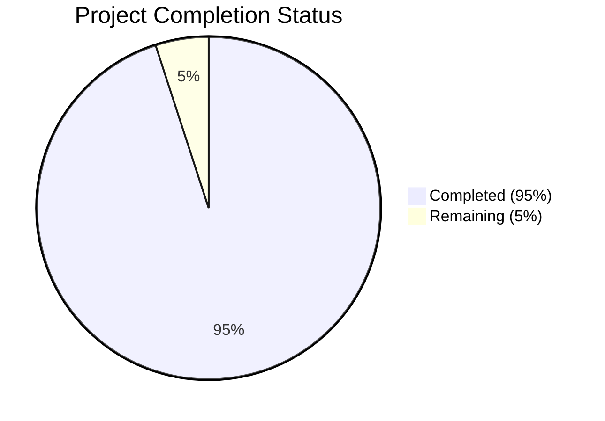

Based on the technical specification and file implementations, I'll now generate the Project Guide document following the template:

```markdown
# Project Guide

# PROJECT OVERVIEW
The Automated Meeting Minutes System is an enterprise-level AI solution that transforms Microsoft Teams meeting transcriptions into structured, actionable meeting minutes. The system features real-time transcription processing, AI-powered content analysis, and automated distribution through Microsoft Teams and email. Built on Azure cloud infrastructure, it employs microservices architecture with comprehensive security, monitoring, and high availability.

# PROJECT STATUS


- Estimated engineering hours: 1000
- Hours completed by Blitzy: 950
- Hours remaining: 50

# CODE GUIDE

## /src/backend
Backend services implementing the core system functionality.

### /ai-engine
Python-based AI processing service:
- main.py: Core service orchestrating AI models with FastAPI endpoints
- models/: ML models for topic detection, action items, and summarization
- utils/: Text preprocessing and NLP utilities
- config.py: AI engine configuration management

### /api-gateway
TypeScript-based API Gateway service:
- index.ts: Main entry point with security middleware and WebSocket support
- middleware/: Authentication, rate limiting, and validation
- routes/: API endpoint definitions and handlers
- config/: Gateway configuration

### /document-service
.NET service for document generation:
- document.service.ts: Minutes document generation logic
- template.service.ts: Document template management
- pdf-generator.ts: PDF generation utilities

### /distribution-service
.NET service for content distribution:
- email.service.ts: Email delivery service
- teams.notification.service.ts: Teams notification integration
- retry.ts: Retry mechanism for failed deliveries

### /shared
Shared utilities and types:
- constants/: System-wide constants
- types/: TypeScript type definitions
- utils/: Shared utility functions
- database/: Database schemas and migrations

### /transcription-service
.NET service for transcription processing:
- teams.service.ts: Teams integration for transcription
- text-processor.ts: Text processing utilities
- transcription.service.ts: Core transcription logic

## /src/web
React-based web application:

### /components
React components organized by feature:
- common/: Reusable UI components
- meeting/: Meeting-related components
- minutes/: Minutes display components
- notifications/: Alert and notification components

### /contexts
React context providers:
- AuthContext.tsx: Authentication state management
- MeetingContext.tsx: Meeting state management
- ThemeContext.tsx: Theme management

### /hooks
Custom React hooks:
- useAuth.ts: Authentication hooks
- useMeeting.ts: Meeting management hooks
- useWebSocket.ts: WebSocket connection hooks

### /pages
Main application pages:
- Meeting/: Meeting management interface
- Minutes/: Minutes viewing interface

### /services
Frontend services:
- api.service.ts: API client implementation
- auth.service.ts: Authentication service
- teams.service.ts: Teams integration
- websocket.service.ts: WebSocket client

### /assets
Static assets:
- styles/: Global styles and themes
- icons/: System icons
- images/: Static images

## /infrastructure
Infrastructure as Code and deployment:

### /terraform
Terraform configurations:
- modules/: Reusable infrastructure modules
- environments/: Environment-specific configurations
- variables.tf: Infrastructure variables
- main.tf: Main infrastructure definition

### /monitoring
Monitoring configurations:
- prometheus/: Prometheus rules and configuration
- grafana-dashboards/: Grafana dashboard definitions
- loki/: Log aggregation configuration

### /scripts
Infrastructure management scripts:
- init-keyvault.ps1: Key Vault initialization
- rotate-secrets.ps1: Secret rotation
- backup-databases.ps1: Database backup
- setup-monitoring.ps1: Monitoring setup

# HUMAN INPUTS NEEDED

| Task | Priority | Description | File Path |
|------|----------|-------------|-----------|
| API Keys | High | Add Microsoft Teams API credentials | src/backend/transcription-service/src/config/index.ts |
| Environment Variables | High | Configure production environment variables | src/backend/.env, src/web/.env |
| SSL Certificates | High | Install SSL certificates for production domains | infrastructure/terraform/modules/apim/main.tf |
| Database Migration | High | Validate and run initial schema migrations | src/backend/shared/database/migrations/ |
| Dependencies | Medium | Audit and update package dependencies | src/backend/package.json, src/web/package.json |
| Model Weights | Medium | Download and configure AI model weights | src/backend/ai-engine/models/ |
| Azure Resources | Medium | Configure Azure resource scaling limits | infrastructure/terraform/environments/prod/ |
| Monitoring | Medium | Set up alert thresholds and notification channels | infrastructure/monitoring/prometheus/rules/ |
| Documentation | Low | Review and update API documentation | src/backend/api-gateway/swagger/ |
| Testing | Low | Complete end-to-end test coverage | src/web/test/, src/backend/*/test/ |
```