# Technical Specifications

# 1. INTRODUCTION

## 1.1 EXECUTIVE SUMMARY

The Automated Meeting Minutes System is an AI-powered solution that transforms Microsoft Teams meeting transcriptions into structured, actionable meeting minutes. By automating the capture, processing, and distribution of meeting documentation, the system addresses the significant business challenge of inefficient manual meeting documentation and delayed information sharing.

This system serves meeting organizers, participants, and enterprise administrators by delivering immediate, accurate, and consistently formatted meeting minutes. The solution is expected to reduce documentation effort by 90%, improve meeting follow-up efficiency by 75%, and ensure 100% documentation compliance across the organization.

## 1.2 SYSTEM OVERVIEW

### Project Context

| Aspect | Description |
|--------|-------------|
| Business Context | Enterprise-level solution for automated meeting documentation in Microsoft Teams environment |
| Market Position | First-to-market AI-powered meeting minutes solution with deep Teams integration |
| Current Limitations | Manual meeting documentation, inconsistent formats, delayed distribution |
| Enterprise Integration | Native integration with Microsoft Teams, Azure AD, and enterprise email systems |

### High-Level Description

| Component | Description |
|-----------|-------------|
| Transcription Processing | Real-time capture and cleaning of Teams meeting transcriptions |
| AI Analysis Engine | NLP-based topic extraction, summarization, and action item detection |
| Document Generation | Automated creation of structured meeting minutes from processed content |
| Distribution System | Immediate delivery of generated minutes to relevant stakeholders |

### Success Criteria

| Metric | Target |
|--------|---------|
| Processing Time | < 5 minutes post-meeting |
| Documentation Accuracy | > 95% content accuracy |
| User Adoption | > 80% of eligible meetings |
| Distribution Speed | 100% delivery within 10 minutes |

## 1.3 SCOPE

### In-Scope Elements

#### Core Features and Functionalities

| Feature Category | Components |
|-----------------|------------|
| Transcription | - Teams transcription capture<br>- Real-time text processing<br>- Noise reduction |
| AI Processing | - Topic identification<br>- Key point extraction<br>- Action item detection |
| Document Generation | - Template-based formatting<br>- Metadata inclusion<br>- Content structuring |
| Distribution | - Automated email delivery<br>- Delivery tracking<br>- Retry mechanisms |

#### Implementation Boundaries

| Boundary Type | Coverage |
|--------------|----------|
| System | Microsoft Teams meetings only |
| Users | Enterprise Teams users |
| Geography | Global deployment |
| Data | Meeting transcriptions, participant data, meeting metadata |

### Out-of-Scope Elements

| Category | Excluded Elements |
|----------|------------------|
| Meeting Types | - External participant meetings<br>- Channel meetings<br>- Webinars |
| Languages | Non-English languages |
| Features | - Video recording processing<br>- Real-time translation<br>- Custom template creation |
| Integrations | - Third-party meeting platforms<br>- Project management tools<br>- Custom CRM systems |

# 2. SYSTEM ARCHITECTURE

## 2.1 High-Level Architecture

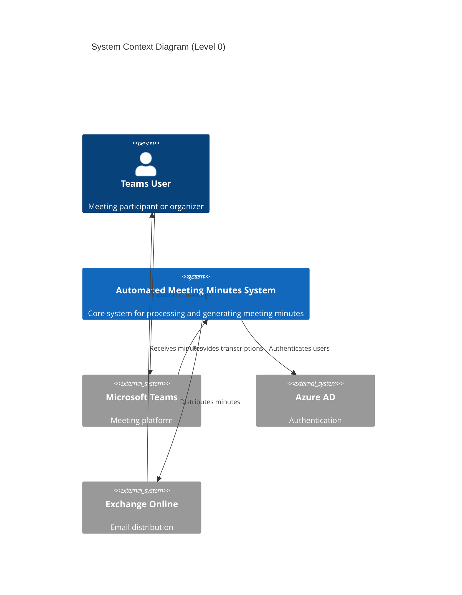
```mermaid
C4Context
    title System Context Diagram (Level 0)
    
    Person(user, "Teams User", "Meeting participant or organizer")
    System(ams, "Automated Meeting Minutes System", "Core system for processing and generating meeting minutes")
    
    System_Ext(teams, "Microsoft Teams", "Meeting platform")
    System_Ext(aad, "Azure AD", "Authentication")
    System_Ext(email, "Exchange Online", "Email distribution")
    
    Rel(user, teams, "Conducts meetings")
    Rel(teams, ams, "Provides transcriptions")
    Rel(ams, aad, "Authenticates users")
    Rel(ams, email, "Distributes minutes")
    Rel(email, user, "Receives minutes")
```

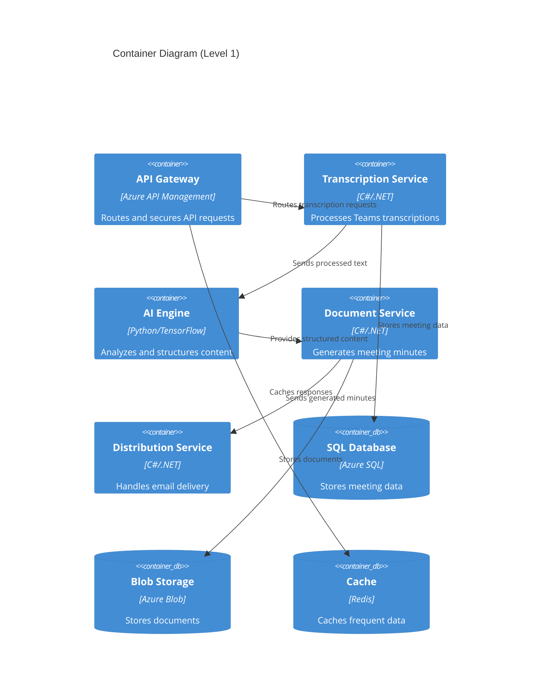
```mermaid
C4Container
    title Container Diagram (Level 1)
    
    Container(api, "API Gateway", "Azure API Management", "Routes and secures API requests")
    Container(trans, "Transcription Service", "C#/.NET", "Processes Teams transcriptions")
    Container(ai, "AI Engine", "Python/TensorFlow", "Analyzes and structures content")
    Container(doc, "Document Service", "C#/.NET", "Generates meeting minutes")
    Container(dist, "Distribution Service", "C#/.NET", "Handles email delivery")
    
    ContainerDb(sql, "SQL Database", "Azure SQL", "Stores meeting data")
    ContainerDb(blob, "Blob Storage", "Azure Blob", "Stores documents")
    ContainerDb(cache, "Cache", "Redis", "Caches frequent data")
    
    Rel(api, trans, "Routes transcription requests")
    Rel(trans, ai, "Sends processed text")
    Rel(ai, doc, "Provides structured content")
    Rel(doc, dist, "Sends generated minutes")
    
    Rel(trans, sql, "Stores meeting data")
    Rel(doc, blob, "Stores documents")
    Rel_R(api, cache, "Caches responses")
```

## 2.2 Component Details

### 2.2.1 API Gateway
| Aspect | Details |
|--------|---------|
| Technology | Azure API Management |
| Purpose | Request routing, authentication, rate limiting |
| Scaling | Horizontal auto-scaling based on request volume |
| APIs | REST/JSON, WebSocket for real-time updates |
| Security | OAuth 2.0, API key management |

### 2.2.2 Transcription Service
| Aspect | Details |
|--------|---------|
| Technology | C#/.NET 6.0 |
| Purpose | Teams integration, transcription processing |
| Storage | Azure SQL Database |
| Scaling | Event-driven auto-scaling |
| APIs | Teams Graph API, internal REST APIs |

### 2.2.3 AI Engine
| Aspect | Details |
|--------|---------|
| Technology | Python 3.9, TensorFlow 2.x |
| Purpose | NLP processing, content analysis |
| Processing | Async batch processing |
| Scaling | GPU-enabled container instances |
| APIs | Internal gRPC interfaces |

### 2.2.4 Document Service
| Aspect | Details |
|--------|---------|
| Technology | C#/.NET 6.0 |
| Purpose | Minutes generation and formatting |
| Storage | Azure Blob Storage |
| Scaling | CPU-based auto-scaling |
| APIs | REST/JSON internal APIs |

### 2.2.5 Distribution Service
| Aspect | Details |
|--------|---------|
| Technology | C#/.NET 6.0 |
| Purpose | Email delivery and tracking |
| Integration | Exchange Online API |
| Scaling | Queue-based processing |
| APIs | SMTP, Exchange Web Services |

## 2.3 Technical Decisions

### 2.3.1 Architecture Style
| Decision | Rationale |
|----------|-----------|
| Microservices | - Independent scaling of components<br>- Technology flexibility<br>- Isolated failure domains |
| Event-driven | - Asynchronous processing<br>- Loose coupling<br>- Better scalability |
| API-first | - Clear interface contracts<br>- Service independence<br>- Easy integration |

### 2.3.2 Data Architecture

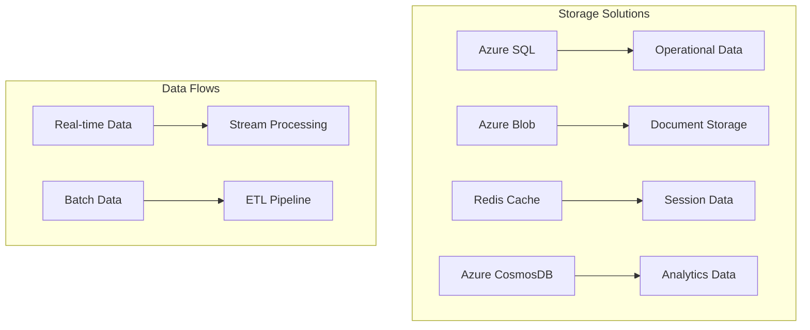
```mermaid
flowchart TD
    subgraph Storage Solutions
        A[Azure SQL] --> B[Operational Data]
        C[Azure Blob] --> D[Document Storage]
        E[Redis Cache] --> F[Session Data]
        G[Azure CosmosDB] --> H[Analytics Data]
    end
    
    subgraph Data Flows
        I[Real-time Data] --> J[Stream Processing]
        K[Batch Data] --> L[ETL Pipeline]
    end
```

## 2.4 Cross-Cutting Concerns

### 2.4.1 Monitoring Architecture

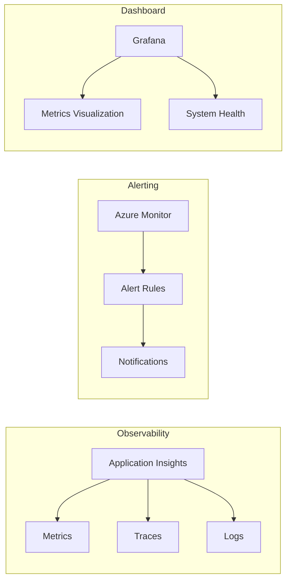
```mermaid
flowchart LR
    subgraph Observability
        A[Application Insights] --> B[Metrics]
        A --> C[Traces]
        A --> D[Logs]
    end
    
    subgraph Alerting
        E[Azure Monitor] --> F[Alert Rules]
        F --> G[Notifications]
    end
    
    subgraph Dashboard
        H[Grafana] --> I[Metrics Visualization]
        H --> J[System Health]
    end
```

### 2.4.2 Security Architecture

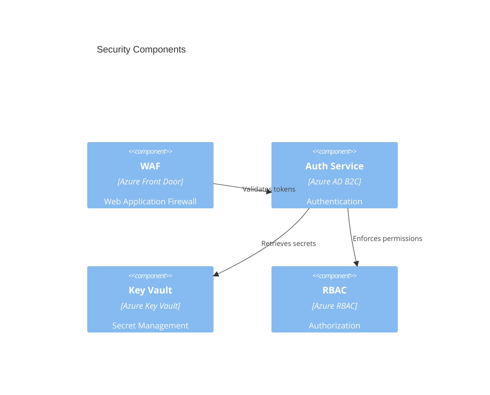
```mermaid
C4Component
    title Security Components
    
    Component(waf, "WAF", "Azure Front Door", "Web Application Firewall")
    Component(auth, "Auth Service", "Azure AD B2C", "Authentication")
    Component(vault, "Key Vault", "Azure Key Vault", "Secret Management")
    Component(rbac, "RBAC", "Azure RBAC", "Authorization")
    
    Rel(waf, auth, "Validates tokens")
    Rel(auth, vault, "Retrieves secrets")
    Rel(auth, rbac, "Enforces permissions")
```

## 2.5 Deployment Architecture

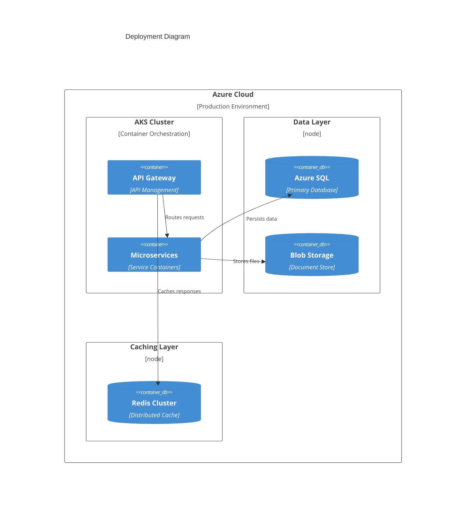
```mermaid
C4Deployment
    title Deployment Diagram
    
    Deployment_Node(az, "Azure Cloud", "Production Environment") {
        Deployment_Node(aks, "AKS Cluster", "Container Orchestration") {
            Container(api, "API Gateway", "API Management")
            Container(svc, "Microservices", "Service Containers")
        }
        
        Deployment_Node(data, "Data Layer") {
            ContainerDb(sql, "Azure SQL", "Primary Database")
            ContainerDb(blob, "Blob Storage", "Document Store")
        }
        
        Deployment_Node(cache, "Caching Layer") {
            ContainerDb(redis, "Redis Cluster", "Distributed Cache")
        }
    }
    
    Rel(api, svc, "Routes requests")
    Rel(svc, sql, "Persists data")
    Rel(svc, blob, "Stores files")
    Rel(api, redis, "Caches responses")
```

# 3. SYSTEM COMPONENTS ARCHITECTURE

## 3.1 USER INTERFACE DESIGN

### 3.1.1 Design Specifications

| Aspect | Requirements |
|--------|--------------|
| Visual Hierarchy | - Minimalist Teams-aligned design<br>- Clear content hierarchy<br>- Consistent typography scale<br>- White space optimization |
| Design System | - Microsoft Fluent UI components<br>- Teams color palette integration<br>- Standard Teams iconography<br>- Consistent spacing units |
| Responsive Design | - Breakpoints: 320px, 768px, 1024px, 1440px<br>- Fluid typography scaling<br>- Flexible grid system<br>- Mobile-first approach |
| Accessibility | - WCAG 2.1 Level AA compliance<br>- ARIA landmarks and labels<br>- Keyboard navigation support<br>- Screen reader optimization |
| Device Support | - Desktop: Chrome, Edge, Firefox, Safari<br>- Mobile: iOS Safari, Android Chrome<br>- Minimum supported resolutions: 320x568px |
| Theming | - Automatic dark/light mode switching<br>- Teams theme inheritance<br>- High contrast mode support |
| i18n/l10n | - RTL layout support<br>- Unicode character handling<br>- Date/time localization<br>- Number formatting |

### 3.1.2 Interface Elements

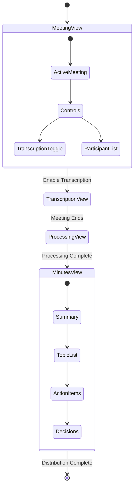
```mermaid
stateDiagram-v2
    [*] --> MeetingView
    MeetingView --> TranscriptionView: Enable Transcription
    TranscriptionView --> ProcessingView: Meeting Ends
    ProcessingView --> MinutesView: Processing Complete
    MinutesView --> [*]: Distribution Complete
    
    state MeetingView {
        [*] --> ActiveMeeting
        ActiveMeeting --> Controls
        Controls --> TranscriptionToggle
        Controls --> ParticipantList
    }
    
    state MinutesView {
        [*] --> Summary
        Summary --> TopicList
        TopicList --> ActionItems
        ActionItems --> Decisions
    }
```

### 3.1.3 Error Handling

| Error Type | UI Response |
|------------|-------------|
| Network Error | - Offline indicator<br>- Retry button<br>- Sync status display |
| Processing Error | - Error banner with details<br>- Manual retry option<br>- Support contact information |
| Validation Error | - Inline field validation<br>- Error message tooltips<br>- Form submission blocking |
| Authorization Error | - Session expiration notice<br>- Re-authentication prompt<br>- Graceful state recovery |

## 3.2 DATABASE DESIGN

### 3.2.1 Schema Design

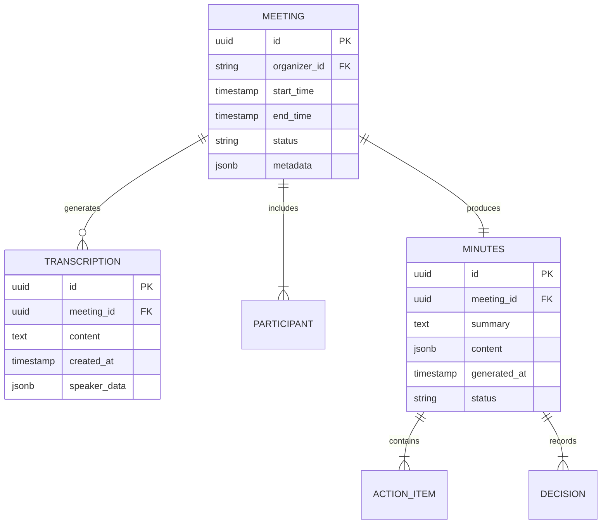
```mermaid
erDiagram
    MEETING ||--o{ TRANSCRIPTION : generates
    MEETING ||--|{ PARTICIPANT : includes
    MEETING ||--|| MINUTES : produces
    MINUTES ||--|{ ACTION_ITEM : contains
    MINUTES ||--|{ DECISION : records
    
    MEETING {
        uuid id PK
        string organizer_id FK
        timestamp start_time
        timestamp end_time
        string status
        jsonb metadata
    }
    
    TRANSCRIPTION {
        uuid id PK
        uuid meeting_id FK
        text content
        timestamp created_at
        jsonb speaker_data
    }
    
    MINUTES {
        uuid id PK
        uuid meeting_id FK
        text summary
        jsonb content
        timestamp generated_at
        string status
    }
```

### 3.2.2 Data Management Strategy

| Aspect | Implementation |
|--------|----------------|
| Partitioning | - Time-based partitioning for transcriptions<br>- Hash partitioning for meetings<br>- Range partitioning for historical data |
| Indexing | - B-tree indexes on lookup columns<br>- Full-text search indexes on content<br>- Composite indexes for common queries |
| Archival | - 90-day active data retention<br>- Yearly partitioned archive tables<br>- Compressed storage for archives |
| Backup | - Daily full backups<br>- 6-hour differential backups<br>- 15-minute transaction log backups |

### 3.2.3 Performance Optimization

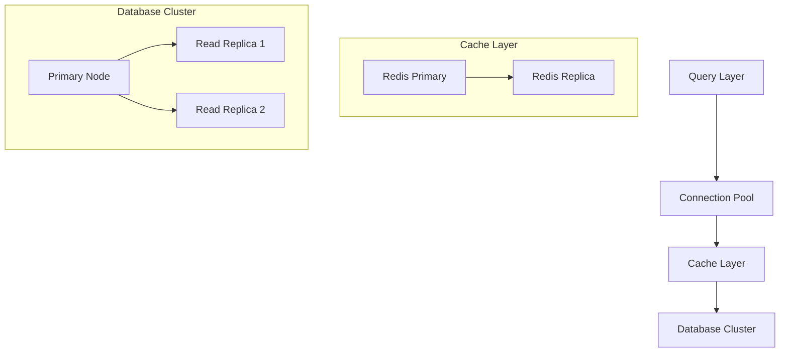
```mermaid
flowchart TD
    A[Query Layer] --> B[Connection Pool]
    B --> C[Cache Layer]
    C --> D[Database Cluster]
    
    subgraph Cache Layer
        C1[Redis Primary]
        C2[Redis Replica]
        C1 --> C2
    end
    
    subgraph Database Cluster
        D1[Primary Node]
        D2[Read Replica 1]
        D3[Read Replica 2]
        D1 --> D2
        D1 --> D3
    end
```

## 3.3 API DESIGN

### 3.3.1 API Architecture

| Component | Specification |
|-----------|--------------|
| Protocol | REST over HTTPS |
| Authentication | OAuth 2.0 with JWT |
| Content Type | application/json |
| Versioning | URI-based (v1, v2) |
| Rate Limiting | 1000 requests/minute/client |
| Documentation | OpenAPI 3.0 Specification |

### 3.3.2 API Endpoints

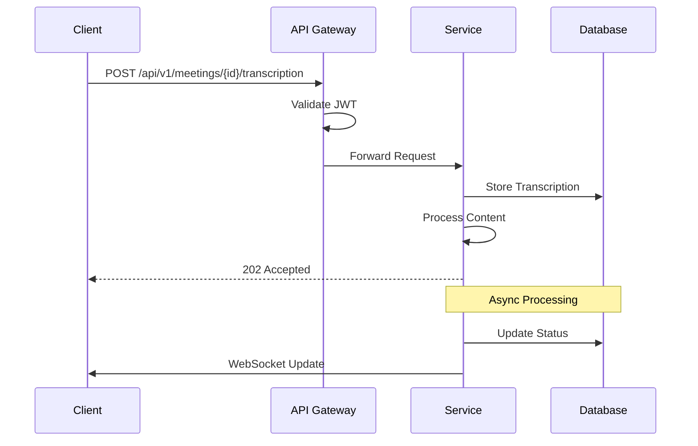
```mermaid
sequenceDiagram
    participant C as Client
    participant G as API Gateway
    participant S as Service
    participant D as Database
    
    C->>G: POST /api/v1/meetings/{id}/transcription
    G->>G: Validate JWT
    G->>S: Forward Request
    S->>D: Store Transcription
    S->>S: Process Content
    S-->>C: 202 Accepted
    
    Note over S,D: Async Processing
    
    S->>D: Update Status
    S->>C: WebSocket Update
```

### 3.3.3 Integration Patterns

| Pattern | Implementation |
|---------|----------------|
| Circuit Breaker | - 5xx error threshold: 50%<br>- Reset timeout: 30s<br>- Half-open state retry: 3 requests |
| Retry Policy | - Max attempts: 3<br>- Exponential backoff<br>- Jitter: 100-300ms |
| Rate Limiting | - Token bucket algorithm<br>- Per-client tracking<br>- Burst allowance: 20% |
| Caching | - Response caching: 5 minutes<br>- Cache invalidation hooks<br>- Stale-while-revalidate: 30s |

# 4. TECHNOLOGY STACK

## 4.1 PROGRAMMING LANGUAGES

| Platform/Component | Language | Version | Justification |
|-------------------|----------|---------|---------------|
| API Services | C# | .NET 6.0 | - Native Microsoft ecosystem integration<br>- Strong type safety<br>- High performance for API processing |
| AI Engine | Python | 3.9 | - Rich NLP library ecosystem<br>- TensorFlow/PyTorch support<br>- Efficient text processing capabilities |
| Document Processing | C# | .NET 6.0 | - Efficient document manipulation<br>- Microsoft Office format support<br>- Teams SDK compatibility |
| Infrastructure Scripts | PowerShell | 7.2 | - Azure automation support<br>- Native Windows integration<br>- Enterprise deployment tools |

## 4.2 FRAMEWORKS & LIBRARIES

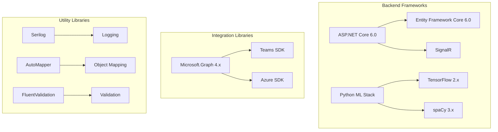
```mermaid
flowchart TD
    subgraph Backend Frameworks
        A[ASP.NET Core 6.0] --> B[Entity Framework Core 6.0]
        A --> C[SignalR]
        D[Python ML Stack] --> E[TensorFlow 2.x]
        D --> F[spaCy 3.x]
    end
    
    subgraph Integration Libraries
        G[Microsoft.Graph 4.x] --> H[Teams SDK]
        G --> I[Azure SDK]
    end
    
    subgraph Utility Libraries
        J[Serilog] --> K[Logging]
        L[AutoMapper] --> M[Object Mapping]
        N[FluentValidation] --> O[Validation]
    end
```

### Core Frameworks
| Framework | Version | Purpose | Justification |
|-----------|---------|---------|---------------|
| ASP.NET Core | 6.0 | API Development | - Enterprise-grade performance<br>- Native Azure integration<br>- Microservices support |
| TensorFlow | 2.x | AI Processing | - Production-ready ML capabilities<br>- Extensive NLP support<br>- Cloud deployment optimized |
| Entity Framework Core | 6.0 | Data Access | - ORM for SQL operations<br>- LINQ support<br>- Migration management |
| SignalR | 6.0 | Real-time Communications | - WebSocket management<br>- Client-server updates<br>- Scale-out support |

## 4.3 DATABASES & STORAGE

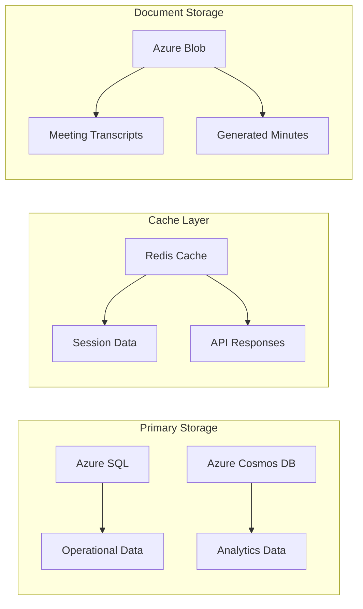
```mermaid
flowchart LR
    subgraph Primary Storage
        A[Azure SQL] --> B[Operational Data]
        C[Azure Cosmos DB] --> D[Analytics Data]
    end
    
    subgraph Cache Layer
        E[Redis Cache] --> F[Session Data]
        E --> G[API Responses]
    end
    
    subgraph Document Storage
        H[Azure Blob] --> I[Meeting Transcripts]
        H --> J[Generated Minutes]
    end
```

| Storage Type | Technology | Purpose | Configuration |
|--------------|------------|---------|---------------|
| Primary Database | Azure SQL | Transactional data | - High Availability mode<br>- Geo-replication<br>- Auto-scaling |
| Document Store | Azure Blob Storage | File storage | - RA-GRS redundancy<br>- Hot access tier<br>- Lifecycle management |
| Cache | Azure Redis Cache | Performance optimization | - Premium tier<br>- Cluster mode<br>- 99.9% SLA |
| Analytics | Azure Cosmos DB | Reporting data | - Multi-region writes<br>- Analytical store<br>- Automatic indexing |

## 4.4 THIRD-PARTY SERVICES

| Service Category | Provider | Purpose | Integration Method |
|-----------------|----------|---------|-------------------|
| Authentication | Azure AD B2C | User identity | - OAuth 2.0/OIDC<br>- JWT tokens |
| API Management | Azure APIM | API gateway | - OpenAPI specs<br>- Policy enforcement |
| Monitoring | Application Insights | Telemetry | - SDK integration<br>- Custom metrics |
| Email Delivery | Exchange Online | Minutes distribution | - Graph API<br>- SMTP relay |

## 4.5 DEVELOPMENT & DEPLOYMENT

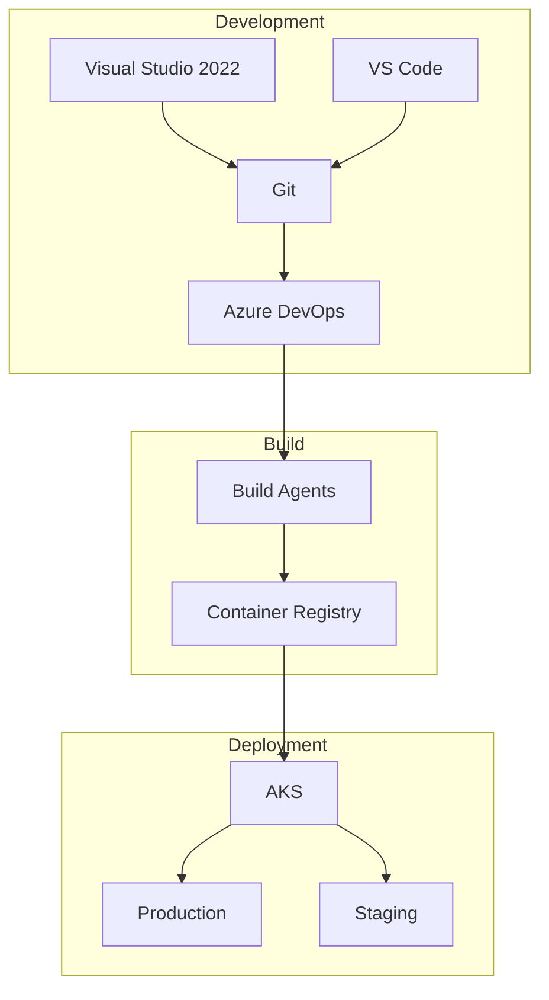
```mermaid
flowchart TD
    subgraph Development
        A[Visual Studio 2022] --> B[Git]
        C[VS Code] --> B
        B --> D[Azure DevOps]
    end
    
    subgraph Build
        D --> E[Build Agents]
        E --> F[Container Registry]
    end
    
    subgraph Deployment
        F --> G[AKS]
        G --> H[Production]
        G --> I[Staging]
    end
```

### Development Tools
| Tool | Version | Purpose |
|------|---------|---------|
| Visual Studio | 2022 | Primary IDE |
| VS Code | Latest | Secondary IDE |
| Git | Latest | Version control |
| Azure DevOps | Cloud | CI/CD platform |

### Deployment Pipeline
| Stage | Technology | Configuration |
|-------|------------|---------------|
| Containerization | Docker | - Multi-stage builds<br>- Azure Container Registry |
| Orchestration | AKS | - Auto-scaling<br>- Blue-green deployments |
| Infrastructure | Terraform | - Infrastructure as Code<br>- State management |
| Monitoring | Azure Monitor | - Container insights<br>- Log analytics |

# 5. SYSTEM DESIGN

## 5.1 USER INTERFACE DESIGN

The system primarily operates as a background service integrated with Microsoft Teams, with minimal direct user interface elements.

### 5.1.1 Teams Integration Interface

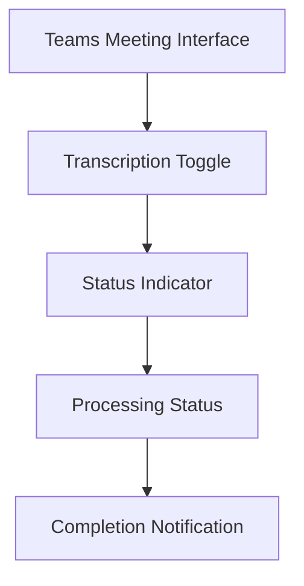
```mermaid
flowchart TD
    A[Teams Meeting Interface] --> B[Transcription Toggle]
    B --> C[Status Indicator]
    C --> D[Processing Status]
    D --> E[Completion Notification]
```

| UI Element | Description | Behavior |
|------------|-------------|-----------|
| Transcription Toggle | Native Teams control | Enables/disables automatic minutes generation |
| Status Indicator | Visual feedback element | Shows real-time processing status |
| Processing Banner | Temporary notification | Appears post-meeting during processing |
| Completion Alert | Teams notification | Indicates minutes have been distributed |

### 5.1.2 Email Output Interface

| Component | Format | Content |
|-----------|---------|---------|
| Subject Line | `{Meeting Title} - Minutes ({Date})` | Meeting identification |
| Header | Organization branding | Logo and meeting metadata |
| Body | Structured HTML | Formatted meeting minutes |
| Footer | Contact information | Support details and links |

## 5.2 DATABASE DESIGN

### 5.2.1 Data Model

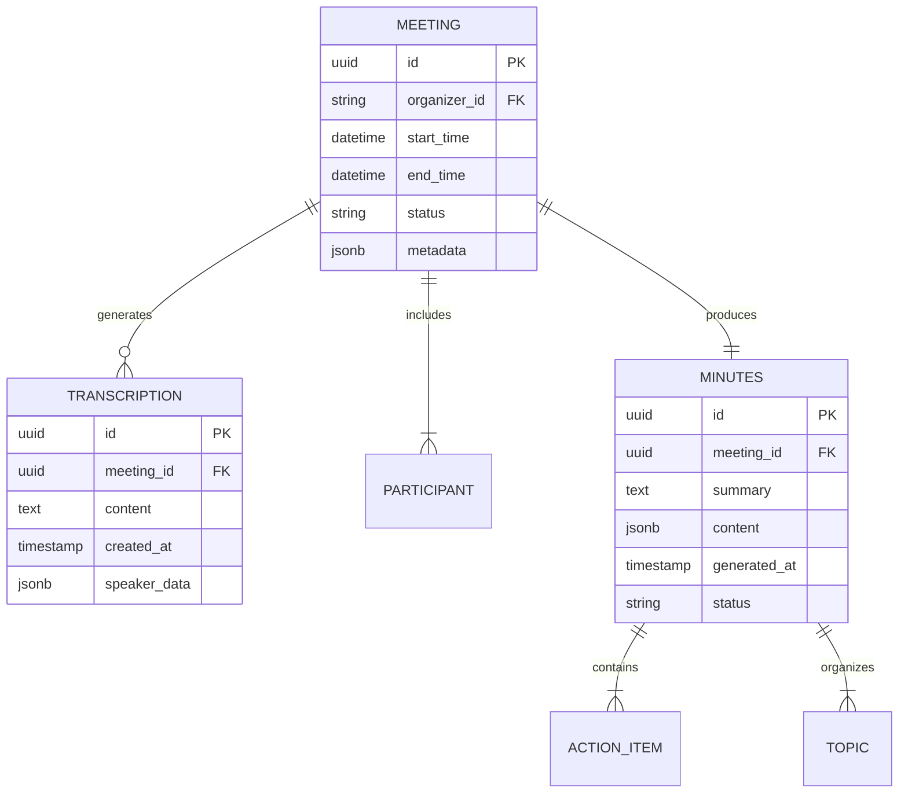
```mermaid
erDiagram
    MEETING ||--o{ TRANSCRIPTION : generates
    MEETING ||--|{ PARTICIPANT : includes
    MEETING ||--|| MINUTES : produces
    MINUTES ||--|{ ACTION_ITEM : contains
    MINUTES ||--|{ TOPIC : organizes
    
    MEETING {
        uuid id PK
        string organizer_id FK
        datetime start_time
        datetime end_time
        string status
        jsonb metadata
    }
    
    TRANSCRIPTION {
        uuid id PK
        uuid meeting_id FK
        text content
        timestamp created_at
        jsonb speaker_data
    }
    
    MINUTES {
        uuid id PK
        uuid meeting_id FK
        text summary
        jsonb content
        timestamp generated_at
        string status
    }
```

### 5.2.2 Storage Architecture

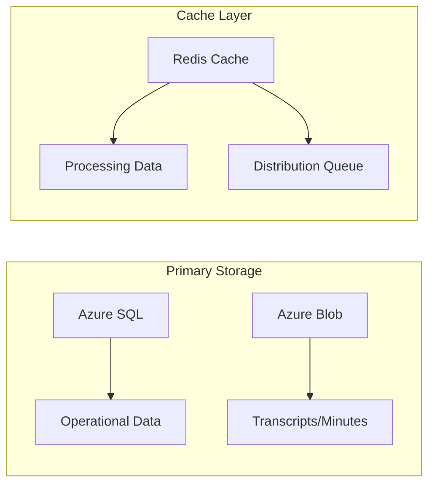
```mermaid
flowchart LR
    subgraph Primary Storage
        A[Azure SQL] --> B[Operational Data]
        C[Azure Blob] --> D[Transcripts/Minutes]
    end
    
    subgraph Cache Layer
        E[Redis Cache] --> F[Processing Data]
        E --> G[Distribution Queue]
    end
```

### 5.2.3 Data Access Patterns

| Operation | Pattern | Caching Strategy |
|-----------|---------|-----------------|
| Meeting Creation | Write-through | No cache |
| Transcription Processing | Write-behind | Temporary cache |
| Minutes Generation | Read-heavy | Cache results |
| Distribution | Queue-based | Cache queue |

## 5.3 API DESIGN

### 5.3.1 API Architecture

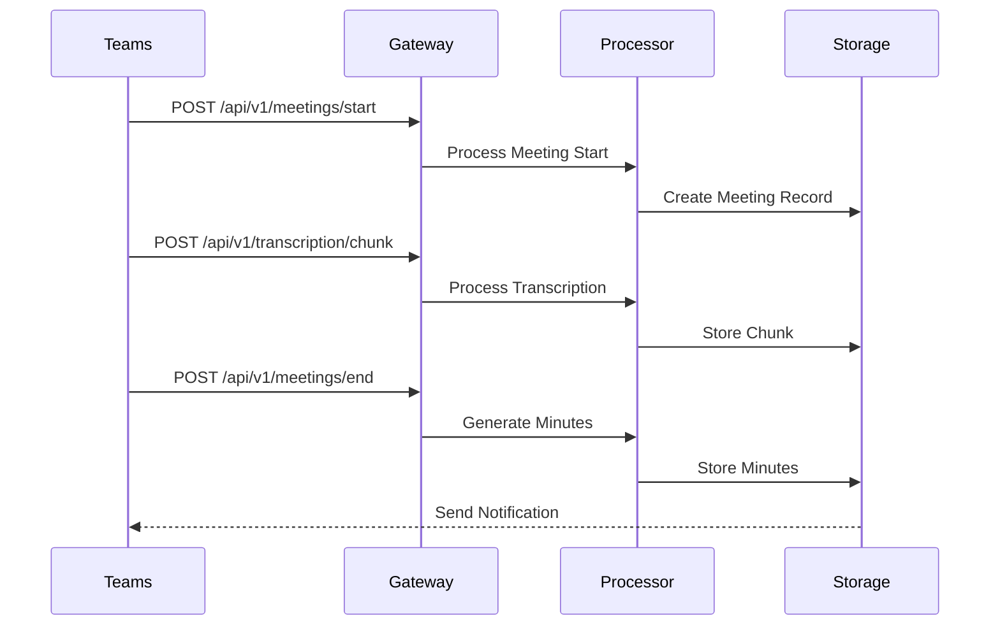
```mermaid
sequenceDiagram
    participant Teams
    participant Gateway
    participant Processor
    participant Storage
    
    Teams->>Gateway: POST /api/v1/meetings/start
    Gateway->>Processor: Process Meeting Start
    Processor->>Storage: Create Meeting Record
    
    Teams->>Gateway: POST /api/v1/transcription/chunk
    Gateway->>Processor: Process Transcription
    Processor->>Storage: Store Chunk
    
    Teams->>Gateway: POST /api/v1/meetings/end
    Gateway->>Processor: Generate Minutes
    Processor->>Storage: Store Minutes
    Storage-->>Teams: Send Notification
```

### 5.3.2 API Endpoints

| Endpoint | Method | Purpose | Authentication |
|----------|--------|---------|----------------|
| `/api/v1/meetings` | POST | Create meeting record | OAuth 2.0 |
| `/api/v1/transcription` | POST | Process transcription | OAuth 2.0 |
| `/api/v1/minutes` | GET | Retrieve minutes | OAuth 2.0 |
| `/api/v1/distribution` | POST | Trigger distribution | OAuth 2.0 |

### 5.3.3 Error Handling

| Error Category | HTTP Status | Retry Strategy |
|----------------|-------------|----------------|
| Authentication | 401, 403 | No retry |
| Rate Limiting | 429 | Exponential backoff |
| Server Errors | 5xx | 3 retries with backoff |
| Validation | 400 | No retry |

### 5.3.4 API Security

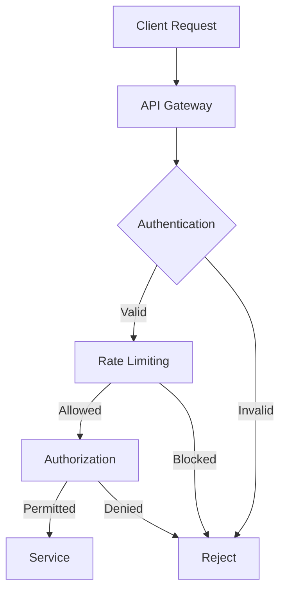
```mermaid
flowchart TD
    A[Client Request] --> B[API Gateway]
    B --> C{Authentication}
    C -->|Valid| D[Rate Limiting]
    D -->|Allowed| E[Authorization]
    E -->|Permitted| F[Service]
    
    C -->|Invalid| G[Reject]
    D -->|Blocked| G
    E -->|Denied| G
```

# 6. USER INTERFACE DESIGN

## 6.1 Teams Integration Interface

### 6.1.1 Meeting Controls
```
+------------------------------------------+
|  Microsoft Teams Meeting                  |
|  +--------------------------------------+|
|  |                                      ||
|  |           Meeting Content            ||
|  |                                      ||
|  +--------------------------------------+|
|  +-----------------+ +------------------+|
|  | Meeting Controls| |   AMS Controls   ||
|  | [=] [!] [@] [#]| |[x]Stop Minutes   ||
|  |                 | |[*]Auto-Capture   ||
|  |                 | |[?]Help           ||
|  +-----------------+ +------------------+|
+------------------------------------------+

Key:
[=] - Teams Settings
[!] - Notifications
[@] - Participants
[#] - More Options
[x] - Stop Recording
[*] - Toggle Feature
[?] - Help Menu
```

### 6.1.2 Processing Status Overlay
```
+------------------------------------------+
|  [!] Minutes Processing                   |
|  +--------------------------------------+|
|  | Status: Processing Transcription     ||
|  | [============================  ] 80% ||
|  |                                      ||
|  | Estimated Completion: 2 minutes      ||
|  +--------------------------------------+|
|  [Cancel] [Hide]                         |
+------------------------------------------+

Key:
[!] - Status Indicator
[====] - Progress Bar
[Cancel] - Cancel Button
[Hide] - Minimize Overlay
```

### 6.1.3 Completion Notification
```
+------------------------------------------+
|  [*] Minutes Generated                    |
|  +--------------------------------------+|
|  | Meeting minutes have been generated   ||
|  | and distributed to all participants.  ||
|  |                                      ||
|  | [View Minutes] [Download] [Share]    ||
|  +--------------------------------------+|
+------------------------------------------+

Key:
[*] - Success Indicator
[View Minutes] - Action Button
[Download] - Download Button
[Share] - Share Button
```

## 6.2 Email Interface

### 6.2.1 Minutes Email Template
```
+------------------------------------------+
| Subject: Meeting Minutes - {Title}        |
+------------------------------------------+
| [Logo]                                   |
| Meeting Minutes                          |
+------------------------------------------+
| Date: {date}                             |
| Time: {start} - {end}                    |
| Organizer: {name}                        |
+------------------------------------------+
| SUMMARY                                  |
| +--------------------------------------+|
| |{AI-generated summary}                ||
| +--------------------------------------+|
|                                         |
| KEY TOPICS                              |
| +--{Topic 1}                           |
| |  +--{Subtopic 1.1}                   |
| |  +--{Subtopic 1.2}                   |
| +--{Topic 2}                           |
|    +--{Subtopic 2.1}                   |
|                                         |
| ACTION ITEMS                            |
| [ ] {Action 1} - @{assignee}           |
| [ ] {Action 2} - @{assignee}           |
|                                         |
| DECISIONS                               |
| • {Decision 1}                          |
| • {Decision 2}                          |
+------------------------------------------+
| [View Online] [Download PDF] [Feedback]  |
+------------------------------------------+

Key:
[ ] - Checkbox for Action Items
@{assignee} - Assigned Person
• - Bullet Points
[Buttons] - Action Buttons
+-- - Hierarchical Structure
```

## 6.3 Accessibility Features

| Feature | Implementation |
|---------|---------------|
| Keyboard Navigation | Full keyboard control with visible focus indicators |
| Screen Reader Support | ARIA labels and landmarks throughout interface |
| Color Contrast | WCAG 2.1 AA compliant contrast ratios |
| Text Scaling | Supports 200% text size increase |
| Focus Management | Logical tab order and focus trapping in modals |

## 6.4 Responsive Behavior

| Breakpoint | Layout Adjustments |
|------------|-------------------|
| Mobile (<768px) | Single column, stacked controls |
| Tablet (768-1024px) | Two column, condensed controls |
| Desktop (>1024px) | Full layout with expanded controls |

## 6.5 Error States

```
+------------------------------------------+
|  [!] Error State                         |
|  +--------------------------------------+|
|  | Unable to process meeting minutes.    ||
|  |                                      ||
|  | Error: {error_message}               ||
|  |                                      ||
|  | [Retry] [Report Issue] [Dismiss]     ||
|  +--------------------------------------+|
+------------------------------------------+

Key:
[!] - Error Indicator
{error_message} - Dynamic Error Text
[Buttons] - Action Buttons
```

# 7. SECURITY CONSIDERATIONS

## 7.1 AUTHENTICATION AND AUTHORIZATION

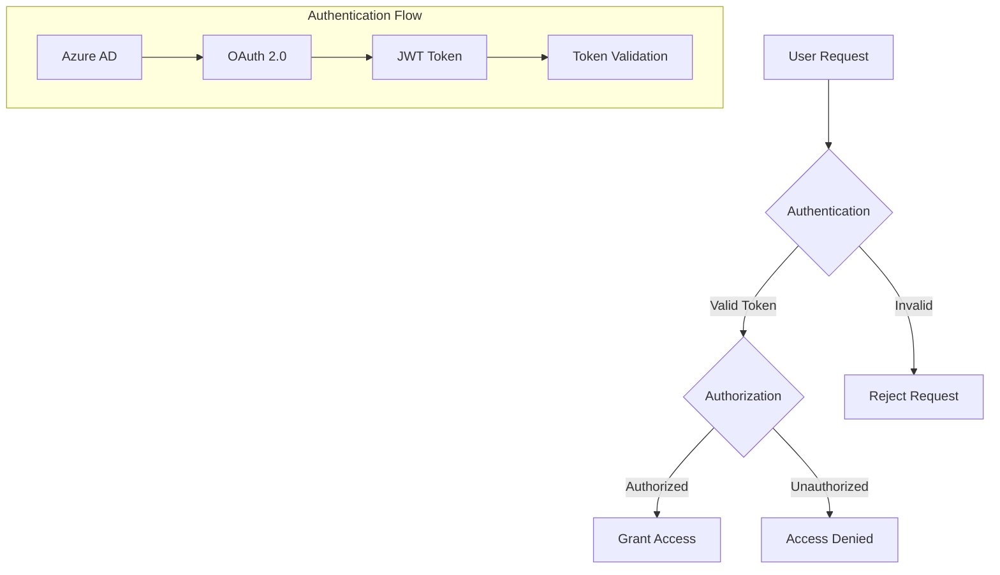
```mermaid
flowchart TD
    A[User Request] --> B{Authentication}
    B -->|Valid Token| C{Authorization}
    B -->|Invalid| D[Reject Request]
    C -->|Authorized| E[Grant Access]
    C -->|Unauthorized| F[Access Denied]
    
    subgraph Authentication Flow
        G[Azure AD] --> H[OAuth 2.0]
        H --> I[JWT Token]
        I --> J[Token Validation]
    end
```

| Authentication Method | Implementation | Purpose |
|----------------------|----------------|----------|
| Azure AD B2C | Primary authentication | Enterprise user identity management |
| OAuth 2.0 | Authorization framework | Secure delegated access |
| JWT Tokens | Bearer tokens | Session management |
| MSAL Library | Authentication client | Microsoft identity platform integration |

### Role-Based Access Control (RBAC)

| Role | Permissions | Access Level |
|------|------------|--------------|
| Meeting Organizer | Create, Read, Update, Delete | Full access to meeting content |
| Meeting Participant | Read | View minutes and transcripts |
| System Admin | Full System Access | System configuration and monitoring |
| Auditor | Read-only | Access to audit logs and reports |

## 7.2 DATA SECURITY

### Encryption Standards

| Data State | Method | Key Management |
|------------|---------|----------------|
| At Rest | AES-256 | Azure Key Vault |
| In Transit | TLS 1.3 | Managed certificates |
| In Memory | Secure memory encryption | Hardware security |
| Backups | AES-256 with separate keys | Isolated key storage |

### Data Classification

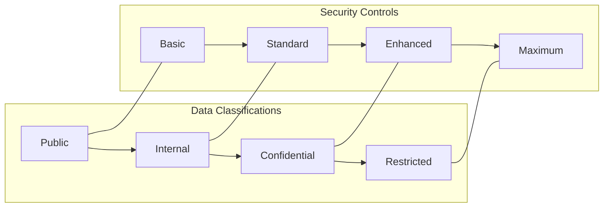
```mermaid
flowchart LR
    subgraph Data Classifications
        A[Public] --> B[Internal]
        B --> C[Confidential]
        C --> D[Restricted]
    end
    
    subgraph Security Controls
        E[Basic] --> F[Standard]
        F --> G[Enhanced]
        G --> H[Maximum]
    end
    
    A --- E
    B --- F
    C --- G
    D --- H
```

## 7.3 SECURITY PROTOCOLS

### Network Security

| Layer | Protection Measure | Implementation |
|-------|-------------------|----------------|
| Perimeter | Azure Front Door WAF | DDoS protection, IP filtering |
| Network | Network Security Groups | Port control, traffic filtering |
| Application | API Management | Rate limiting, request validation |
| Database | Firewall Rules | Access control, connection encryption |

### Security Monitoring

```mermaid
flowchart TD
    A[Security Events] --> B[Azure Monitor]
    B --> C[Log Analytics]
    C --> D[Security Center]
    
    subgraph Detection
        E[Threat Detection]
        F[Anomaly Detection]
        G[Access Monitoring]
    end
    
    D --> E
    D --> F
    D --> G
```

### Compliance Controls

| Requirement | Implementation | Validation |
|-------------|----------------|------------|
| GDPR | Data minimization, consent management | Regular audits |
| SOC 2 | Access controls, encryption | Annual certification |
| ISO 27001 | Security management framework | External audits |
| Data Residency | Regional deployment | Geo-fencing |

### Security Response

```mermaid
flowchart LR
    A[Security Event] --> B{Severity Assessment}
    B -->|High| C[Immediate Response]
    B -->|Medium| D[Standard Response]
    B -->|Low| E[Scheduled Response]
    
    subgraph Response Actions
        C --> F[System Isolation]
        C --> G[Incident Response Team]
        D --> H[Investigation]
        E --> I[Monitoring]
    end
```

### Vulnerability Management

| Component | Scanning Frequency | Remediation SLA |
|-----------|-------------------|-----------------|
| Infrastructure | Daily automated scans | Critical: 24h, High: 72h |
| Applications | Weekly SAST/DAST | Critical: 48h, High: 1 week |
| Dependencies | Daily dependency checks | Critical: 24h, High: 72h |
| Containers | Pre-deployment scans | Must fix Critical/High before deployment |

# 8. INFRASTRUCTURE

## 8.1 DEPLOYMENT ENVIRONMENT

```mermaid
flowchart TD
    subgraph Production Environment
        A[Azure Cloud] --> B[Primary Region]
        A --> C[Secondary Region]
        
        subgraph Region Components
            D[AKS Cluster]
            E[Azure SQL]
            F[Azure Cache]
            G[Azure Storage]
        end
        
        B --> D
        B --> E
        B --> F
        B --> G
    end
```

| Environment | Configuration | Purpose |
|-------------|--------------|----------|
| Production | Multi-region Azure deployment | Primary production workload |
| Staging | Single-region Azure deployment | Pre-production validation |
| Development | Azure development subscription | Development and testing |
| DR | Secondary region hot standby | Business continuity |

## 8.2 CLOUD SERVICES

| Service | Purpose | Configuration |
|---------|---------|--------------|
| Azure Kubernetes Service (AKS) | Container orchestration | - Node pools: 3-5 nodes<br>- VM Size: Standard_D4s_v3<br>- Autoscaling enabled |
| Azure SQL Database | Primary data storage | - Business Critical tier<br>- Geo-replication enabled<br>- Auto-failover groups |
| Azure Cache for Redis | Performance optimization | - Premium P2 tier<br>- 10GB cache<br>- Zone redundancy |
| Azure Blob Storage | Document storage | - RA-GRS redundancy<br>- Hot access tier<br>- Lifecycle management |
| Azure API Management | API gateway | - Premium tier<br>- Regional deployment<br>- Custom domain |

## 8.3 CONTAINERIZATION

```mermaid
flowchart LR
    subgraph Container Architecture
        A[Base Images] --> B[Service Images]
        B --> C[Runtime Containers]
        
        subgraph Service Images
            D[API Service]
            E[Processing Service]
            F[Distribution Service]
        end
        
        subgraph Runtime
            G[Pod]
            H[ConfigMap]
            I[Secret]
        end
    end
```

| Component | Implementation | Configuration |
|-----------|----------------|---------------|
| Base Image | .NET 6.0 Alpine | Minimal secure base |
| Service Images | Multi-stage builds | Optimized for size and security |
| Registry | Azure Container Registry | Premium SKU with geo-replication |
| Security | Container scanning | Qualys vulnerability scanning |

## 8.4 ORCHESTRATION

```mermaid
flowchart TD
    subgraph AKS Cluster
        A[Ingress Controller] --> B[Service Mesh]
        B --> C[Pod Management]
        
        subgraph Workloads
            D[API Pods]
            E[Processing Pods]
            F[Distribution Pods]
        end
        
        C --> D
        C --> E
        C --> F
    end
```

| Component | Configuration | Purpose |
|-----------|--------------|----------|
| AKS | - Version: 1.25+<br>- RBAC enabled<br>- Network policy | Container orchestration |
| Istio | - Version: 1.18+<br>- mTLS enabled<br>- Traffic management | Service mesh |
| NGINX Ingress | - SSL termination<br>- Rate limiting<br>- WAF integration | Load balancing |

## 8.5 CI/CD PIPELINE

```mermaid
flowchart LR
    A[Source Code] --> B[Build]
    B --> C[Test]
    C --> D[Security Scan]
    D --> E[Artifact Creation]
    E --> F[Deploy to Staging]
    F --> G[Integration Tests]
    G --> H[Deploy to Production]
    
    subgraph Azure DevOps
        B
        C
        D
        E
    end
    
    subgraph Environments
        F
        G
        H
    end
```

| Stage | Tools | Configuration |
|-------|-------|--------------|
| Source Control | Azure Repos | - Branch policies<br>- Code review requirements |
| Build | Azure Pipelines | - YAML pipelines<br>- Multi-stage builds |
| Testing | - NUnit<br>- SonarQube | - Unit tests<br>- Code coverage>80% |
| Security | - OWASP ZAP<br>- WhiteSource | - SAST/DAST scans<br>- Dependency checks |
| Deployment | Azure Pipelines | - Blue-green deployment<br>- Automated rollback |

### Deployment Strategy

| Environment | Strategy | Validation |
|-------------|----------|------------|
| Development | Direct deployment | Basic smoke tests |
| Staging | Blue-green deployment | Full integration tests |
| Production | Canary release | Progressive traffic shift |
| DR | Active-passive | Automated failover tests |

# 9. APPENDICES

## 9.1 ADDITIONAL TECHNICAL INFORMATION

### Meeting Processing Pipeline Details

```mermaid
flowchart TD
    A[Teams Transcription] --> B[Text Preprocessing]
    B --> C[AI Analysis]
    C --> D[Document Generation]
    
    subgraph Text Preprocessing
        B1[Remove Filler Words]
        B2[Clean Speech Artifacts]
        B3[Normalize Text]
        B1 --> B2 --> B3
    end
    
    subgraph AI Analysis
        C1[Topic Detection]
        C2[Key Point Extraction]
        C3[Action Item Recognition]
        C1 --> C2 --> C3
    end
    
    subgraph Document Generation
        D1[Apply Template]
        D2[Format Content]
        D3[Generate PDF]
        D1 --> D2 --> D3
    end
```

### AI Model Performance Metrics

| Metric | Target Value | Acceptable Range |
|--------|--------------|------------------|
| Topic Detection Accuracy | 95% | 90-98% |
| Action Item Recognition | 90% | 85-95% |
| Summary Generation Quality | 85% | 80-90% |
| Processing Time per Minute | 3 seconds | 2-5 seconds |

## 9.2 GLOSSARY

| Term | Definition |
|------|------------|
| Action Item | A specific task or deliverable identified during the meeting requiring follow-up |
| Blue-Green Deployment | A deployment strategy using two identical environments for zero-downtime updates |
| Canary Release | Gradual rollout of changes to a subset of users before full deployment |
| Dead Letter Queue | Storage for messages that cannot be processed successfully |
| Filler Words | Non-essential words or sounds in speech (um, uh, like, etc.) |
| Hot Standby | A backup system that's fully operational and ready to take over immediately |
| Meeting Minutes | Formal record of a meeting's proceedings including decisions and action items |
| Speech Artifacts | Unintended elements in transcribed text from speech patterns or technical issues |
| Topic Extraction | AI-powered identification of main discussion subjects from conversation |
| Transcription | Written record of spoken content from the meeting |

## 9.3 ACRONYMS

| Acronym | Full Form |
|---------|-----------|
| AKS | Azure Kubernetes Service |
| APIM | Azure API Management |
| ARIA | Accessible Rich Internet Applications |
| DAST | Dynamic Application Security Testing |
| DDoS | Distributed Denial of Service |
| ETL | Extract, Transform, Load |
| gRPC | Google Remote Procedure Call |
| HSM | Hardware Security Module |
| MTBF | Mean Time Between Failures |
| MTTR | Mean Time To Repair |
| NLP | Natural Language Processing |
| OIDC | OpenID Connect |
| PII | Personally Identifiable Information |
| RA-GRS | Read-Access Geo-Redundant Storage |
| RBAC | Role-Based Access Control |
| SAST | Static Application Security Testing |
| SLA | Service Level Agreement |
| TDS | Tabular Data Stream |
| WAF | Web Application Firewall |
| WCAG | Web Content Accessibility Guidelines |

## 9.4 REFERENCE ARCHITECTURE

```mermaid
C4Context
    title System Reference Architecture
    
    Person(user, "Teams User", "Meeting participant")
    System(ams, "Meeting Minutes System", "Core processing system")
    
    System_Ext(teams, "Microsoft Teams", "Meeting platform")
    System_Ext(aad, "Azure AD", "Authentication")
    System_Ext(email, "Exchange Online", "Distribution")
    
    Rel(user, teams, "Conducts meetings")
    Rel(teams, ams, "Sends transcriptions")
    Rel(ams, aad, "Authenticates")
    Rel(ams, email, "Distributes minutes")
    Rel(email, user, "Receives minutes")
```

## 9.5 COMPLIANCE MATRIX

| Requirement | Implementation | Validation Method |
|-------------|----------------|-------------------|
| Data Privacy | Encryption at rest and transit | Security audit |
| Access Control | Azure AD integration with RBAC | Access testing |
| Audit Logging | Comprehensive activity tracking | Log analysis |
| Data Retention | Configurable retention policies | Policy verification |
| Disaster Recovery | Geographic replication | Failover testing |