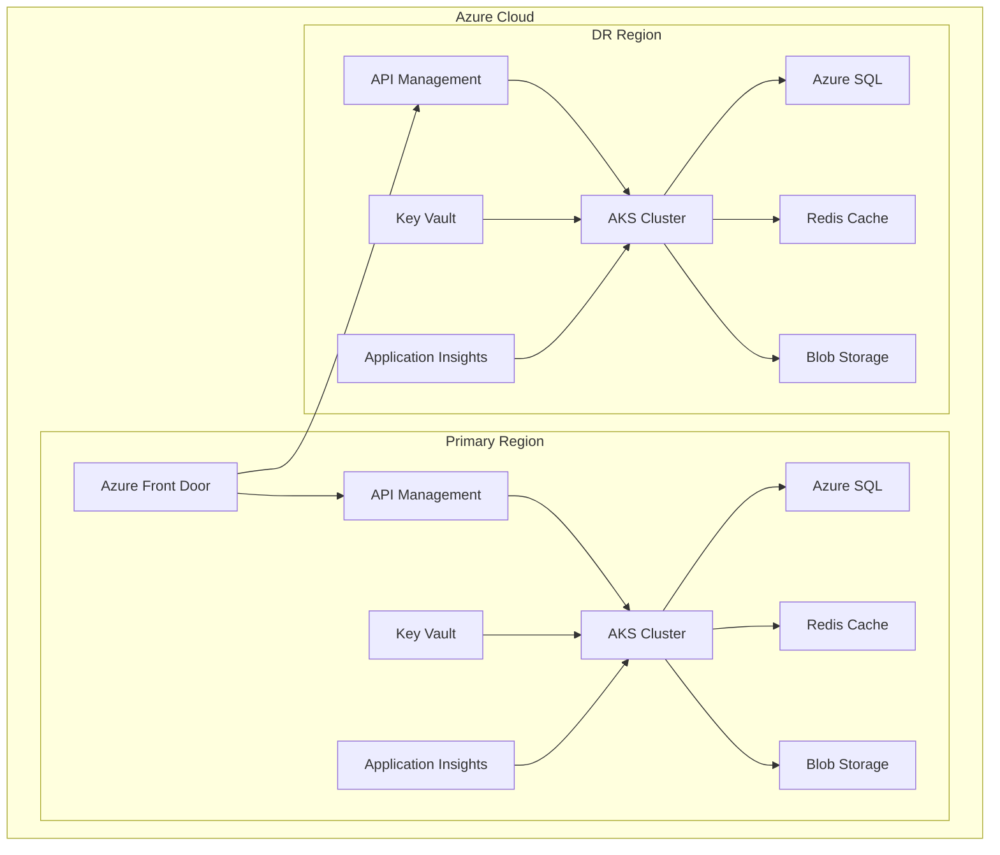
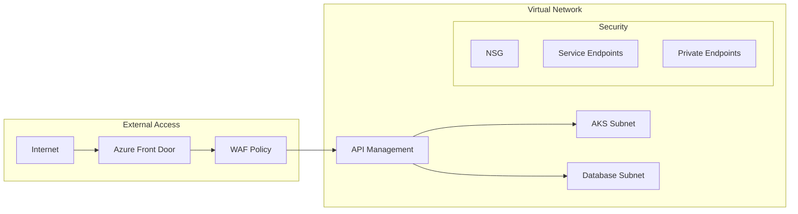
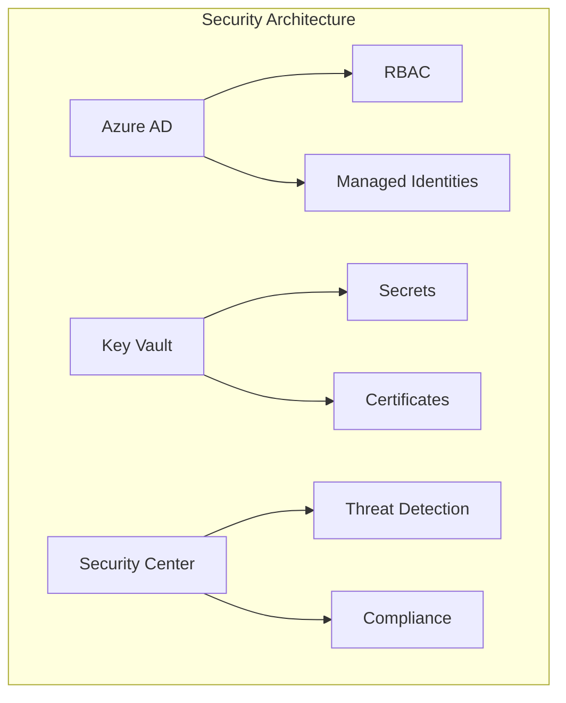
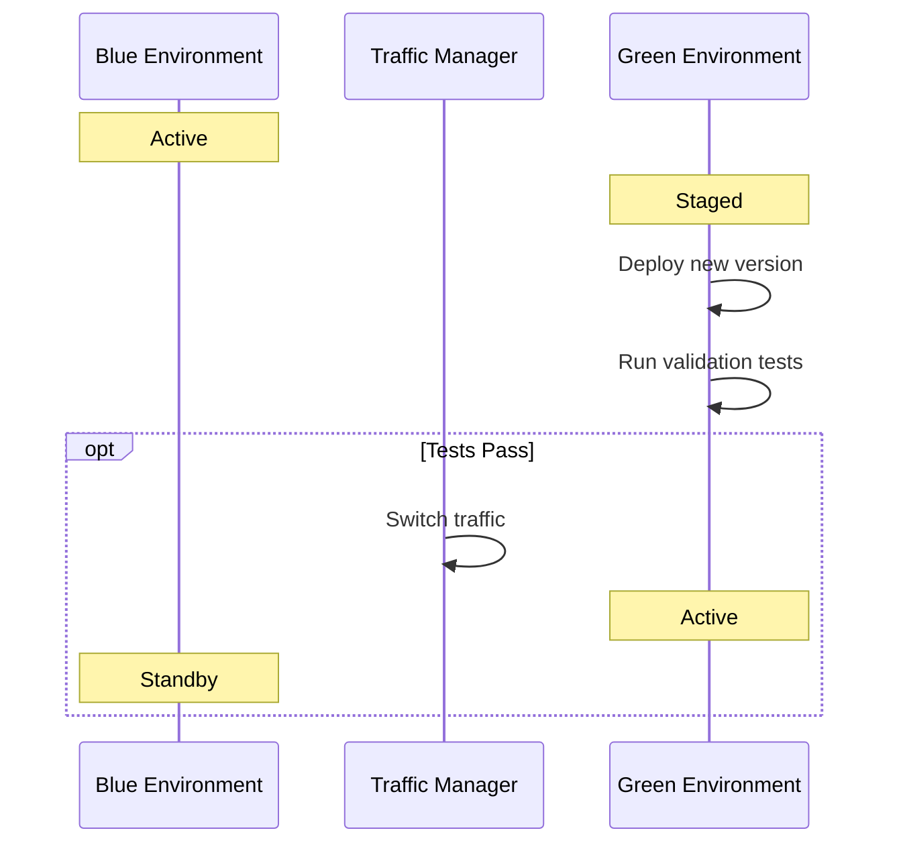

# Infrastructure Documentation - Automated Meeting Minutes System

## Overview

This document provides comprehensive documentation for the Azure-based infrastructure supporting the Automated Meeting Minutes System. The infrastructure is designed for high availability, scalability, and enterprise-grade security, following cloud-native best practices and Infrastructure as Code principles.

## Architecture

### Infrastructure Overview



### Network Architecture



### Security Components



## Prerequisites

### Required Tools
- Azure CLI 2.40+
- Terraform 1.3+
- kubectl 1.25+
- PowerShell 7.2+

### Access Requirements
- Azure Subscription Owner role
- Azure AD Global Administrator
- DevOps Pipeline Administrator

## Infrastructure Components

### AKS Cluster Configuration

#### Production Cluster Specifications
```yaml
Name: ams-prod-aks
Version: 1.25.5
Node Pools:
  System:
    VM Size: Standard_D4s_v3
    Node Count: 3
    Auto-scaling: Enabled (2-5 nodes)
  Application:
    VM Size: Standard_D8s_v3
    Node Count: 5
    Auto-scaling: Enabled (3-10 nodes)
Networking:
  CNI: Azure CNI
  Network Policy: Calico
Monitoring:
  Container Insights: Enabled
  Prometheus Integration: Enabled
```

### Azure SQL High Availability Setup

#### Primary Database Configuration
```yaml
Edition: Business Critical
Service Tier: Premium
Performance Level: P2
Storage: 500GB
Backup Retention: 35 days
Geo-Replication: Enabled
Auto-failover Groups: Configured
```

### Redis Cache Performance Optimization

#### Cache Configuration
```yaml
SKU: Premium P2
Capacity: 10GB
Clustering: Enabled
Availability Zones: Enabled
Persistence: RDB and AOF
Firewall Rules: Strict allow-list
```

### Storage Account Management

#### Blob Storage Configuration
```yaml
Tier: Hot
Redundancy: RA-GRS
Secure Transfer: Required
Network Access: Private Endpoints
Lifecycle Management:
  - Archive after 90 days
  - Delete after 7 years
```

### Key Vault Secret Rotation

#### Rotation Policies
```yaml
SSL Certificates: 90 days
API Keys: 30 days
Database Credentials: 60 days
Service Principals: 90 days
Monitoring: Alert on expiration
```

### API Management Policies

#### Global Policies
```xml
<policies>
    <inbound>
        <rate-limit calls="1000" renewal-period="60" />
        <ip-filter action="allow">
            <address-range from="..." to="..." />
        </ip-filter>
        <authentication-managed-identity resource="..." />
    </inbound>
</policies>
```

## Deployment Procedures

### Production Deployment

1. Infrastructure Provisioning
```bash
# Initialize Terraform
terraform init -backend-config="prod.backend.hcl"

# Plan deployment
terraform plan -var-file="prod.tfvars"

# Apply changes
terraform apply -var-file="prod.tfvars"
```

2. AKS Configuration
```bash
# Get credentials
az aks get-credentials --resource-group ams-prod-rg --name ams-prod-aks

# Apply network policies
kubectl apply -f network-policies/

# Deploy ingress controller
helm upgrade --install ingress-nginx ingress-nginx/ingress-nginx
```

### Blue-Green Deployment Strategy



## Monitoring and Alerting

### Key Metrics

| Metric | Threshold | Action |
|--------|-----------|--------|
| CPU Utilization | >80% | Scale out |
| Memory Usage | >85% | Scale out |
| Response Time | >500ms | Investigate |
| Error Rate | >1% | Alert |

### Alert Configuration

```yaml
Alerts:
  High CPU:
    Threshold: 80%
    Window: 5 minutes
    Action: Auto-scale
  
  Error Spike:
    Threshold: >1% errors
    Window: 2 minutes
    Action: Notify DevOps
  
  Certificate Expiry:
    Threshold: 30 days
    Action: Create ticket
```

## Disaster Recovery

### Recovery Procedures

1. Database Failover
```bash
# Initiate planned failover
az sql db failover --name ams-prod-db --resource-group ams-prod-rg --server ams-prod-sql

# Verify replication status
az sql db show --name ams-prod-db --resource-group ams-prod-rg --server ams-prod-sql
```

2. AKS Recovery
```bash
# Scale emergency node pool
az aks nodepool scale --name emergency-pool --cluster-name ams-prod-aks --resource-group ams-prod-rg --node-count 5

# Verify cluster health
kubectl get nodes -o wide
kubectl get pods --all-namespaces
```

### Recovery Time Objectives

| Component | RTO | RPO |
|-----------|-----|-----|
| Database | 5 minutes | 0 minutes |
| AKS Cluster | 10 minutes | 0 minutes |
| Cache | 2 minutes | 1 minute |
| Storage | 5 minutes | 0 minutes |

## Maintenance Procedures

### Regular Maintenance Tasks

| Task | Frequency | Procedure |
|------|-----------|-----------|
| Node Updates | Monthly | Rolling updates |
| Certificate Rotation | 90 days | Automated rotation |
| Database Index Maintenance | Weekly | Automated maintenance |
| Security Patches | As available | Automated deployment |

### Backup Procedures

```yaml
Database:
  Full: Daily
  Differential: 6 hours
  Transaction Log: 15 minutes
  Retention: 35 days

Storage:
  Snapshot: Daily
  Geo-Replication: Continuous
  Retention: 90 days

Configuration:
  Backup: Daily
  Version Control: Git
  Retention: Indefinite
```

## Security Compliance

### Security Controls

| Control | Implementation | Validation |
|---------|----------------|------------|
| Data Encryption | TLS 1.3, AES-256 | Quarterly audit |
| Access Control | Azure AD, RBAC | Monthly review |
| Network Security | NSGs, WAF | Weekly scan |
| Secret Management | Key Vault | Daily rotation |

### Compliance Monitoring

```yaml
Monitoring:
  Security Center:
    Scope: All resources
    Alerts: Real-time
    Reports: Weekly
  
  Compliance:
    Standards: ISO 27001, SOC 2
    Audits: Quarterly
    Reports: Monthly
```

## Troubleshooting Guide

### Common Issues

| Issue | Diagnosis | Resolution |
|-------|-----------|------------|
| High Latency | Monitor metrics | Scale resources |
| Connection Errors | Check NSG logs | Update rules |
| Certificate Errors | Verify expiry | Rotate certificates |
| Pod Failures | Check logs | Adjust resources |

### Debug Procedures

```bash
# Check pod status
kubectl get pods -n ams-system
kubectl describe pod <pod-name>

# View logs
kubectl logs <pod-name> -n ams-system

# Check node status
kubectl get nodes
kubectl describe node <node-name>
```