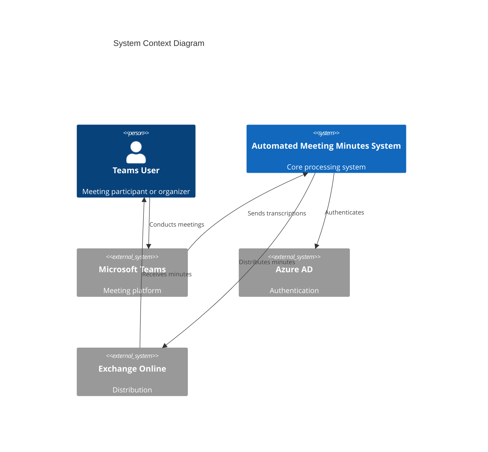
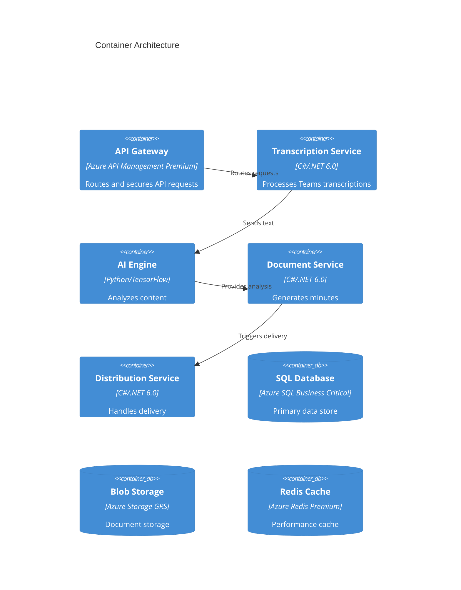
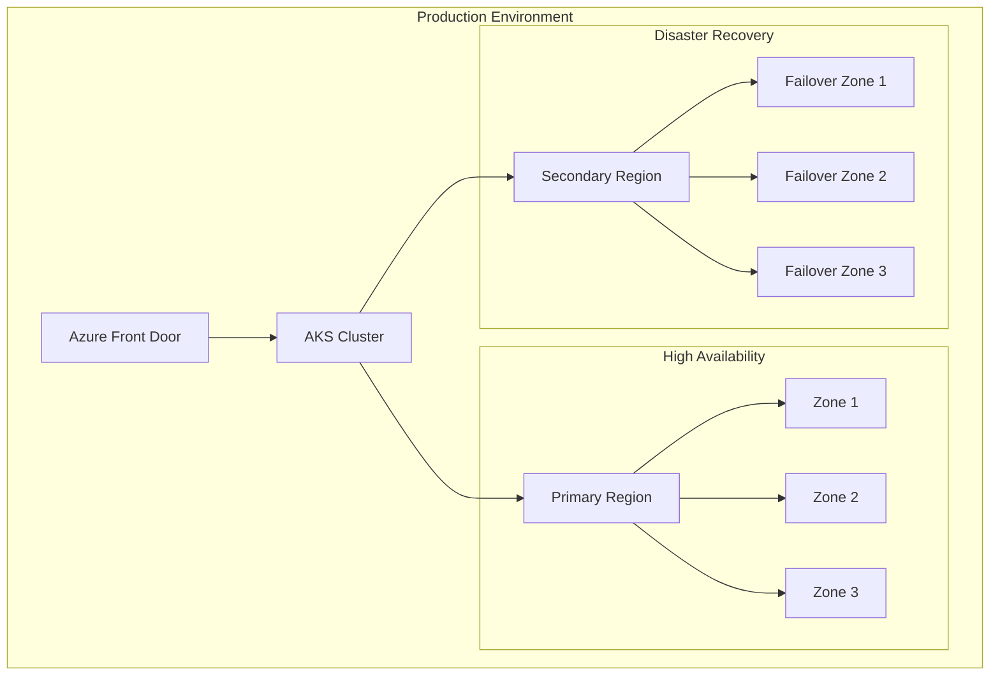
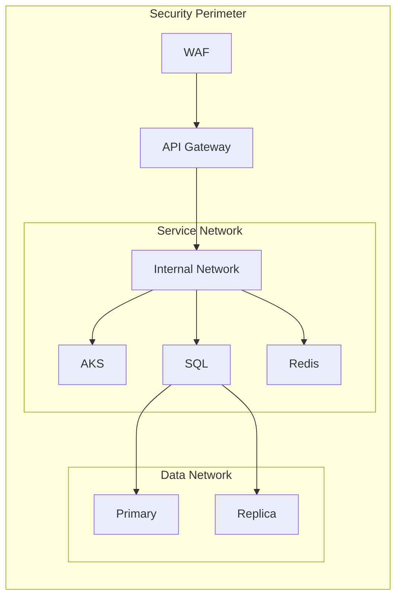

# Automated Meeting Minutes System - Architecture Documentation

## 1. System Overview

### 1.1 High-Level Architecture

### 1.2 Container Architecture

## 2. Infrastructure Components

### 2.1 Azure Kubernetes Service (AKS)

Configuration based on terraform/main.tf:
- Kubernetes version: 1.25
- Node configuration:
  - VM Size: Standard_D4s_v3
  - Initial node count: 3
  - Autoscaling: 3-5 nodes
  - Availability zones: 1, 2, 3
- Networking:
  - Network plugin: Azure CNI
  - Network policy: Calico
  - Pod CIDR: 10.244.0.0/16
  - Service CIDR: 10.0.0.0/16

### 2.2 Azure SQL Database

Business-Critical tier configuration:
- Zone redundancy: Enabled
- Geo-backup: Enabled
- Backup retention: 35 days
- Read replicas: 2
- Min capacity: 4 vCores
- Max size: 256 GB

### 2.3 Azure Redis Cache

Premium tier configuration:
- Capacity: 2
- Sharding: Enabled (2 shards)
- Zone redundancy: Enabled
- TLS: 1.2 required
- Memory policy: volatile-lru
- Reserved memory: 50% for fragmentation

### 2.4 Azure Storage

Standard GRS configuration:
- HTTPS only: Enabled
- TLS version: 1.2
- Public access: Disabled
- Soft delete: 7 days retention
- Network rules: Default deny
- Bypass: Azure Services only

## 3. Deployment Architecture

### 3.1 Production Environment

### 3.2 Environment Configurations

Production specifications:
- Resource locking: Enabled
- Redundancy: Multi-region
- Scaling: Automatic
- Monitoring: Enhanced
- Backup: Geo-redundant

### 3.3 Network Architecture

## 4. Security Architecture

### 4.1 Network Security

- Azure Front Door WAF
- Network Security Groups
- Private endpoints
- Service endpoints
- Pod security policies

### 4.2 Data Security

- TLS 1.2 enforcement
- At-rest encryption
- In-transit encryption
- Key Vault integration
- Managed identities

### 4.3 Access Control

- Azure AD integration
- RBAC implementation
- Network isolation
- Just-in-Time access

## 5. Scaling Guidelines

### 5.1 Horizontal Scaling

AKS:
- Min nodes: 3
- Max nodes: 5
- Scale triggers: CPU/Memory

### 5.2 Vertical Scaling

SQL Database:
- Auto-scaling enabled
- Min capacity: 4 vCores
- Read scaling: Enabled

### 5.3 Caching Strategy

Redis Cache:
- Premium tier
- Clustering enabled
- Zone redundancy
- Memory optimization

## 6. Monitoring Architecture

### 6.1 Observability

- Azure Monitor integration
- Log Analytics workspace
- Application Insights
- Custom metrics
- Distributed tracing

### 6.2 Alerting

- Resource health
- Performance metrics
- Security events
- Cost thresholds
- SLA compliance

## 7. Disaster Recovery

### 7.1 Backup Strategy

- SQL: 35-day retention
- Storage: Geo-redundant
- Configuration: Azure Backup
- Secrets: Key Vault backup

### 7.2 Recovery Procedures

- Regional failover
- Data restoration
- Service recovery
- Configuration recovery