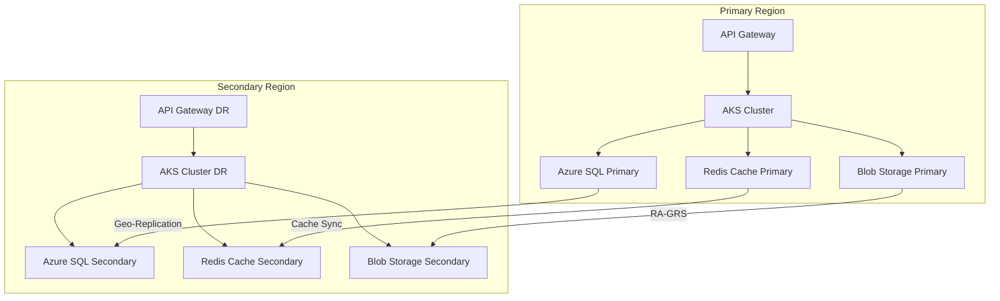
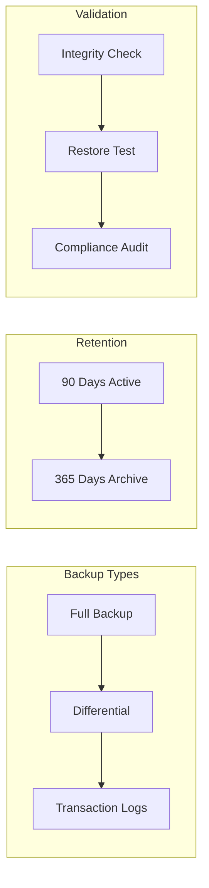
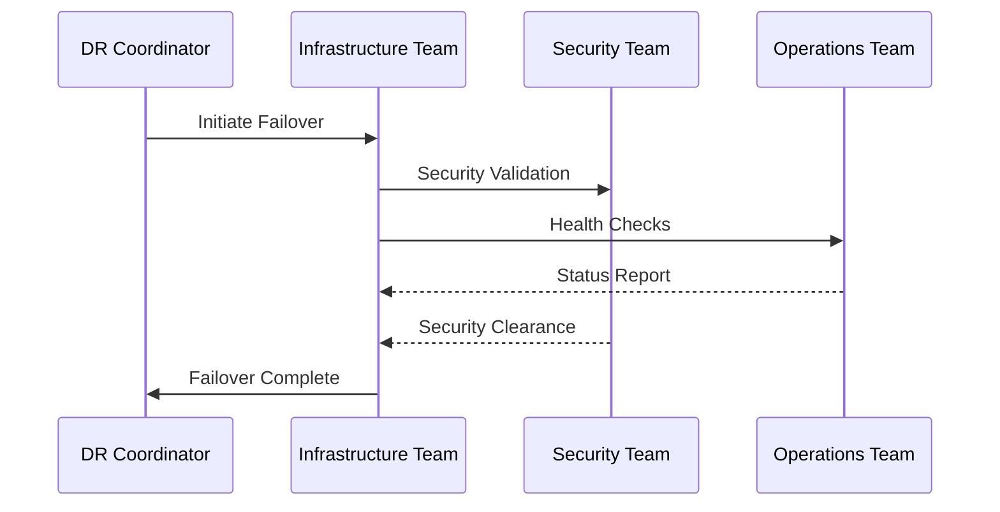

# Disaster Recovery Plan
Version: 1.0
Last Updated: 2024

## Table of Contents
- [Overview](#overview)
- [DR Architecture](#dr-architecture)
- [Backup Strategy](#backup-strategy)
- [Recovery Procedures](#recovery-procedures)
- [Testing and Validation](#testing-and-validation)

## Overview

### Recovery Objectives
- **RTO (Recovery Time Objective)**: < 1 hour
- **RPO (Recovery Point Objective)**: < 5 minutes

### Business Impact Analysis
Critical business functions affected by system downtime:
- Meeting minutes generation and distribution
- Historical meeting data access
- User authentication and authorization
- Compliance and audit capabilities

### Team Responsibilities
| Role | Responsibilities |
|------|-----------------|
| DR Coordinator | Overall DR plan execution and communication |
| Infrastructure Team | Technical recovery procedures and validation |
| Security Team | Security controls and compliance verification |
| Operations Team | System monitoring and health checks |

## DR Architecture

### Multi-Region Setup
- Primary Region: [Azure Region 1]
- Secondary Region: [Azure Region 2]
- Active-Passive Configuration
- Cross-Region Network Latency: < 100ms

### Data Replication
| Component | Replication Method | Frequency | Validation |
|-----------|-------------------|------------|------------|
| Azure SQL | Active geo-replication | Continuous | Hourly checks |
| Blob Storage | RA-GRS | Real-time | Daily integrity |
| Redis Cache | Cross-region sync | Real-time | Continuous |

## Backup Strategy

### Backup Configurations
| Component | Schedule | Retention | Encryption |
|-----------|----------|----------|------------|
| Azure SQL | Daily Full | 90 days | TDE + AKV |
| Blob Storage | Continuous | 365 days | AES-256 |
| Configuration | Per change | Infinite | Azure KV |

## Recovery Procedures

### Region Failover Process

### Failover Steps
1. **Validation Phase**
   - Confirm primary region failure
   - Verify secondary region readiness
   - Check data synchronization status

2. **Execution Phase**
   - Activate secondary region
   - Switch DNS records
   - Enable read-write mode on secondary DB
   - Scale up DR resources

3. **Verification Phase**
   - Run health checks
   - Verify data consistency
   - Test critical functions
   - Validate security controls

4. **Communication Phase**
   - Update status page
   - Notify stakeholders
   - Document incident timeline

### Rollback Procedures
1. **Pre-Rollback Checks**
   - Verify primary region recovery
   - Validate data consistency
   - Check system dependencies

2. **Rollback Execution**
   - Sync delta changes
   - Switch traffic gradually (10% increments)
   - Verify primary region operation
   - Update DNS records

## Testing and Validation

### Test Schedule
| Test Type | Frequency | Duration | Participants |
|-----------|-----------|-----------|--------------|
| Failover Simulation | Quarterly | 4 hours | All teams |
| Backup Restoration | Monthly | 2 hours | Infra & Ops |
| Component Tests | Weekly | 1 hour | Operations |

### Success Criteria
- Complete failover within 1 hour
- Zero data loss during recovery
- All security controls active
- Compliance requirements met
- System performance within SLA

### Documentation Requirements
- Test results and metrics
- Issues encountered
- Resolution steps taken
- Performance data
- Compliance validation
- Sign-off from all teams

## Compliance and Reporting

### Audit Requirements
- Monthly DR readiness reports
- Quarterly test results
- Annual DR plan review
- Incident post-mortems
- Compliance certifications

### Metrics Tracking
| Metric | Target | Measurement |
|--------|---------|-------------|
| Failover Time | < 60 mins | Time to full operation |
| Data Loss | 0 | RPO validation |
| Recovery Success | 100% | Function validation |
| Security Compliance | 100% | Control verification |

## Appendices

### Contact Information
| Team | Primary Contact | Secondary Contact |
|------|-----------------|-------------------|
| DR Coordination | [Name] | [Name] |
| Infrastructure | [Name] | [Name] |
| Security | [Name] | [Name] |
| Operations | [Name] | [Name] |

### Reference Documents
- System Architecture Documentation
- Network Configuration Guide
- Security Controls Documentation
- Compliance Requirements
- SLA Agreements