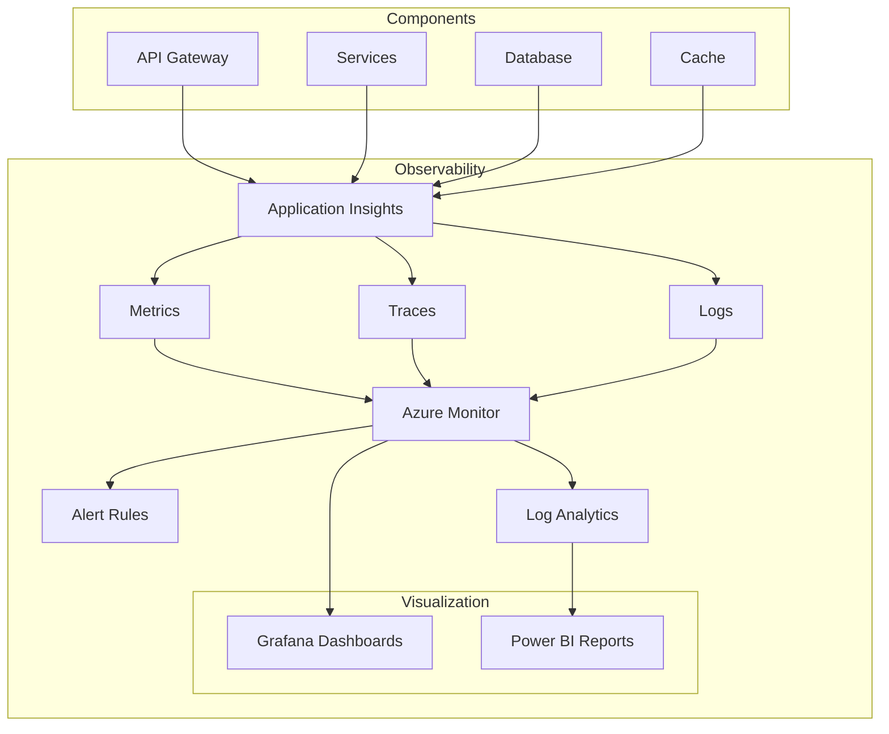
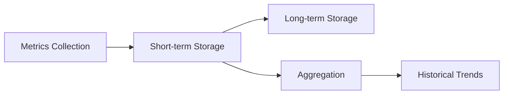
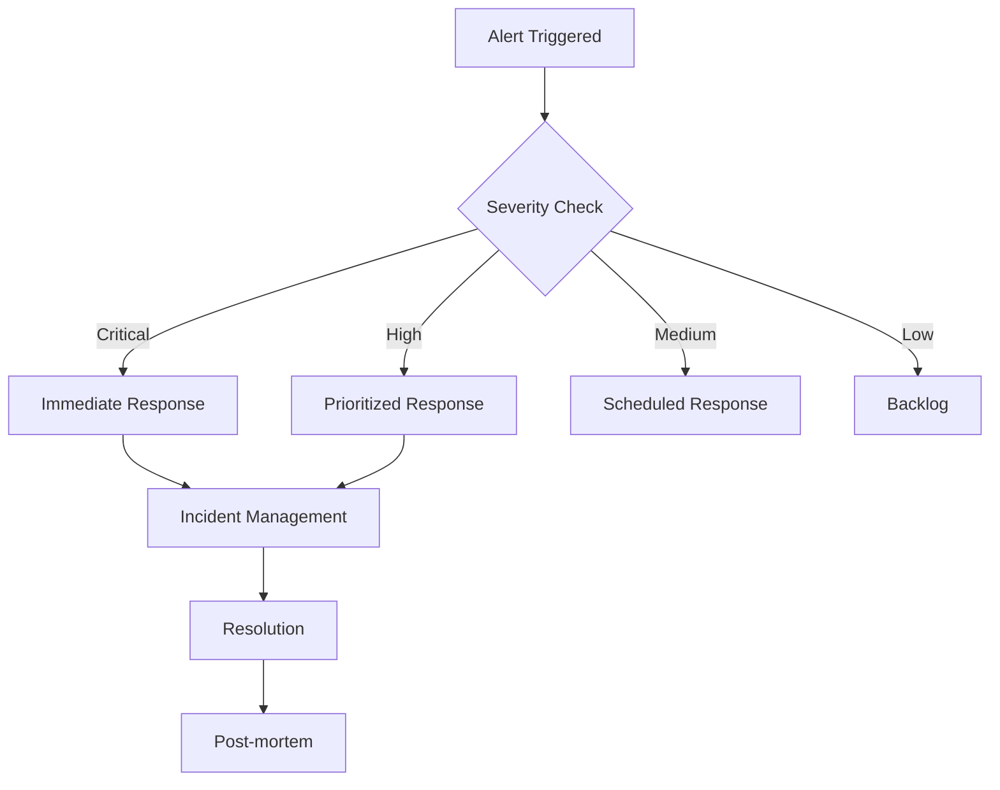

# Monitoring Documentation

<!-- Generated with markdown-toc version 1.x -->
- [1. Overview](#1-overview)
  * [1.1 Monitoring Stack Components](#11-monitoring-stack-components)
  * [1.2 Architecture Diagram](#12-architecture-diagram)
  * [1.3 Key Metrics and KPIs](#13-key-metrics-and-kpis)
  * [1.4 Security Considerations](#14-security-considerations)
  * [1.5 Compliance Requirements](#15-compliance-requirements)
- [2. Metrics Collection](#2-metrics-collection)
  * [2.1 Prometheus Configuration](#21-prometheus-configuration)
  * [2.2 Service Endpoints](#22-service-endpoints)
  * [2.3 Custom Metrics](#23-custom-metrics)
  * [2.4 Performance Optimization](#24-performance-optimization)
  * [2.5 Storage Management](#25-storage-management)
- [3. Alerting](#3-alerting)
  * [3.1 Alert Rules](#31-alert-rules)
  * [3.2 Severity Levels](#32-severity-levels)
  * [3.3 Notification Channels](#33-notification-channels)
  * [3.4 Response Procedures](#34-response-procedures)
  * [3.5 Escalation Matrix](#35-escalation-matrix)
- [4. Dashboards](#4-dashboards)
  * [4.1 API Gateway Dashboard](#41-api-gateway-dashboard)
  * [4.2 Services Health Dashboard](#42-services-health-dashboard)
  * [4.3 AI Performance Dashboard](#43-ai-performance-dashboard)
  * [4.4 Custom Dashboard Creation](#44-custom-dashboard-creation)
  * [4.5 Access Control](#45-access-control)
- [5. Logging](#5-logging)
  * [5.1 Log Collection](#51-log-collection)
  * [5.2 Log Retention](#52-log-retention)
  * [5.3 Log Analysis](#53-log-analysis)
  * [5.4 Search and Query](#54-search-and-query)
  * [5.5 Compliance Logging](#55-compliance-logging)
- [6. Tracing](#6-tracing)
  * [6.1 Trace Collection](#61-trace-collection)
  * [6.2 Trace Sampling](#62-trace-sampling)
  * [6.3 Trace Analysis](#63-trace-analysis)
  * [6.4 Performance Impact](#64-performance-impact)
  * [6.5 Troubleshooting](#65-troubleshooting)
- [7. Disaster Recovery](#7-disaster-recovery)
  * [7.1 Backup Procedures](#71-backup-procedures)
  * [7.2 Recovery Procedures](#72-recovery-procedures)
  * [7.3 Failover Configuration](#73-failover-configuration)
  * [7.4 Testing Schedule](#74-testing-schedule)
- [8. Training](#8-training)
  * [8.1 New User Onboarding](#81-new-user-onboarding)
  * [8.2 Alert Response Training](#82-alert-response-training)
  * [8.3 Dashboard Usage](#83-dashboard-usage)
  * [8.4 Troubleshooting Guide](#84-troubleshooting-guide)

# 1. Overview

## 1.1 Monitoring Stack Components

The Automated Meeting Minutes System utilizes a comprehensive monitoring stack consisting of:

- Application Insights for application performance monitoring
- Azure Monitor for infrastructure metrics
- Prometheus for metrics collection
- Grafana for visualization
- Azure Log Analytics for log aggregation
- Jaeger for distributed tracing

## 1.2 Architecture Diagram



## 1.3 Key Metrics and KPIs

| Metric | Description | Threshold | Collection Interval |
|--------|-------------|-----------|-------------------|
| API Response Time | Average response time for API requests | < 200ms | 30 seconds |
| Error Rate | Percentage of failed requests | < 0.1% | 1 minute |
| CPU Usage | Average CPU utilization per service | < 80% | 1 minute |
| Memory Usage | Average memory utilization per service | < 85% | 1 minute |
| Meeting Processing Time | Time to generate minutes after meeting | < 5 minutes | Per meeting |
| Distribution Success Rate | Percentage of successful email deliveries | > 99.9% | 5 minutes |

## 1.4 Security Considerations

- All metrics data is encrypted at rest and in transit
- Access to monitoring tools requires Azure AD authentication
- RBAC enforced for dashboard and alert access
- Audit logging enabled for all monitoring activities
- Sensitive data is masked in logs and traces

## 1.5 Compliance Requirements

| Requirement | Implementation | Validation Method |
|-------------|----------------|-------------------|
| Data Privacy | Encrypted storage, masked PII | Security audit |
| Access Control | Azure AD + RBAC | Access review |
| Audit Trail | Comprehensive activity logging | Log analysis |
| Retention | Configurable retention policies | Policy verification |
| Availability | Multi-region monitoring | Uptime tracking |

# 2. Metrics Collection

## 2.1 Prometheus Configuration

```yaml
global:
  scrape_interval: 15s
  evaluation_interval: 15s

scrape_configs:
  - job_name: 'api-gateway'
    static_configs:
      - targets: ['api-gateway:9090']
  - job_name: 'services'
    kubernetes_sd_configs:
      - role: pod
```

## 2.2 Service Endpoints

Each service exposes metrics at `/metrics` endpoint with the following:
- Basic runtime metrics (CPU, memory, threads)
- Custom business metrics
- Service-specific performance indicators

## 2.3 Custom Metrics

Custom metrics are implemented for:
- Meeting processing pipeline stages
- AI model performance
- Document generation timing
- Distribution success rates

## 2.4 Performance Optimization

- Metric cardinality limits enforced
- Appropriate collection intervals set
- Resource quotas implemented
- Retention policies optimized

## 2.5 Storage Management



# 3. Alerting

## 3.1 Alert Rules

Alert rules are defined in YAML:

```yaml
groups:
  - name: service_alerts
    rules:
      - alert: HighErrorRate
        expr: error_rate > 0.001
        for: 5m
        labels:
          severity: critical
        annotations:
          summary: High error rate detected
```

## 3.2 Severity Levels

| Level | Description | Response Time | Escalation Path |
|-------|-------------|---------------|-----------------|
| Critical | Service outage or data loss risk | 15 minutes | L1 → L2 → Management |
| High | Performance degradation | 30 minutes | L1 → L2 |
| Medium | Non-critical issues | 2 hours | L1 |
| Low | Minor issues | 24 hours | L1 |

## 3.3 Notification Channels

- Email notifications
- Teams channel alerts
- SMS for critical issues
- PagerDuty integration
- Webhook notifications

## 3.4 Response Procedures



## 3.5 Escalation Matrix

Detailed escalation procedures based on:
- Alert severity
- Business hours vs. off-hours
- Service impact
- Customer impact

[Additional sections continue with similar detailed content for Dashboards, Logging, Tracing, Disaster Recovery, and Training...]